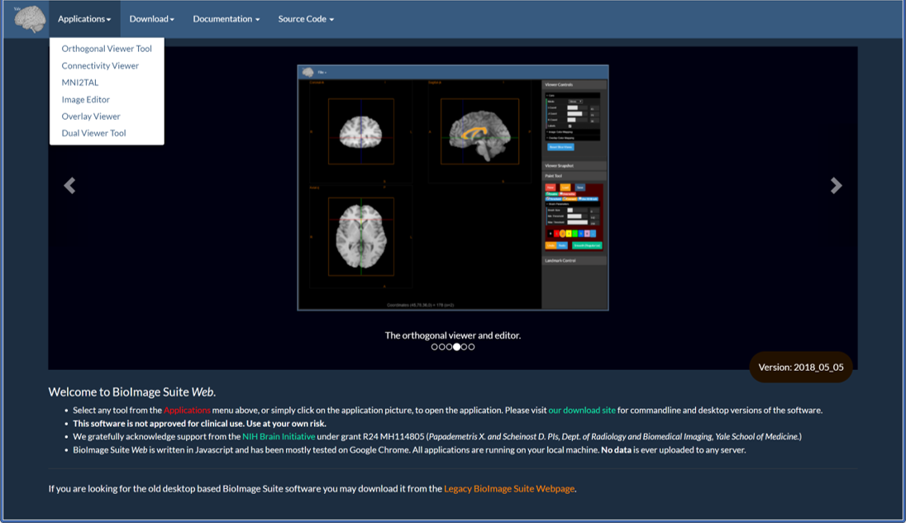

<iframe width="695" height="391" src="https://www.youtube.com/embed/CnbdaQ0O52k" frameborder="0" allow="accelerometer; autoplay; encrypted-media; gyroscope; picture-in-picture" allowfullscreen></iframe>

---

## Table Of Contents

First we conver some core information in this document:

* [Starting BioImage Suite Web](#starting-bioimage-suite-web) — how to get and run the software.
* [Some Key Information](#some-key-information) — information about
  configuring your browser and default image orientations.
* We provide tutorial videos via our
  [YouTube Channel](https://www.youtube.com/channel/UCizfR_ryJ0E-2uZspjwYtwg). We
  will be adding to this over time.

The following documents describe the different applications in BioImage Suite Web.

* [Displaying Images](viewers.md) — we discuss here how the core viewer in BioImage Suite web works (including colormapping etc.). This is shared by the almost all the applications.
* [The Overlay Viewer Application](overlayviewer.md) — an application optimized for displaying functional overlays, including a brief description of the Mosaic Viewer Tool included here.
* [The Image Editor Application](imageeditor.md) — an application that can be used for interactive segmentation and VOI analysis of images.
* [The Connectivity Visualization Tool](tools/conncontrol.md) — an application to visualize connectome matrices.
* [The MNI2TAL Tool](tools/mni2tal.md) — an application to map MNI to Talairach coordinates and 
vice-versa.
* [The Dual Viewer Tool](dualviewer.md) — an advanced dual viewer application. This is intended to be primarily used for image registration tasks.

These documents describe how to perform specific tasks in one or more of the applications in the software.

* [Image Processing Tasks](tools/imageprocessing.md) -- here we describe how to perform basic image processing tasks (e.g. image thresholding, cropping, resampling) using the tools in BioImage Suite Web.
* [Image Segmentation](tools/segmentationtools.md) -- this describes image segmentation functionality in our software.
* [Image Registration](dualviewer.md) -- the image registration tools are described in the document describing the Dual Viewer application.
* [Defacing Images](tools/defacing.md) -- an example of using the tools in BioImage Suite Web to deface a brain image.
* [Live Figures](livefigures/livefigures.md) -- functionality to save the full viewer state (including imaes, slice positions, colormaps, clustering etc.) to a large file that can then be loaded to recreate (and subsequently edit) a current visualization.

The following documents describes advanced application functionality that is common among most of the applications. 

* [Advanced Functionality](tools/advanced.md) -- this document describes advanced functionality such as (i) Loading and Saving the Application State], (ii) copying and pasteing viewer configurations accross applications and (iii) transfering images from viewer to viewer wihin an application.

<!--
* [Offline Mode](tools/pwa.md)  -- this describes the ability of BioImage Suite Web to run offline as a _progressive web application_.
* [Cloud File Access](tools/cloud.md) -- BioImage Suite can read files from cloud sources directly
* [Amazon AWS](tools/AWSBuckets.md) — this describes how to access data in an Amazon S3 bucket from within BioImage Suite.

-->

* [Local Cloud -- the BioImage Suite Web Local File Server](tools/fileserver.md) -- this describes the local file server add on to BioImage Suite Web.

In addition to web applications, BioImage Suite web can be run as desktop applications. This is discussed in the following:

* [Electron Applications](ElectronApps.md) — this is a description of the [Electron-based](https://electronjs.org/) Desktop Applications in Biomage Suite Web.
* [Command Line Tools](CommandLineTools.md) — this is a description of the command line tools in BioImage Suite Web.

The final document discusses running regression testing:

* [Regression Testing](biswebtest.md) — validating your own setup by running the regression test web application in BioImage Suite Web.

__Note:__ This document and those linked to it contain the beginnings of the user documentation for [BioImage Suite Web](https://bioimagesuiteweb.github.io/webapp/). A brief introduction to the software can be found in this [presentation](https://bioimagesuiteweb.github.io/webapp/images/BioImageSuiteWeb_NIHBrainInitiativeMeeting_April2018.pdf). If you are looking for developer documentation, this may be found in [the doc directory of the source repository](https://github.com/bioimagesuiteweb/bisweb/blob/master/docs/README.md).

_This document represents work in progress._

---

### Starting BioImage Suite Web

BioImage Suite Web has three major components:

* [The web application](https://bioimagesuiteweb.github.io/webapp/) 
    * runs in your browser — no installation required!
* The desktop application using [Electron](https://electronjs.org/)
     * may be downloaded from the [download page](http://bisweb.yale.edu/binaries/binaries.html)
* [Command line applications](CommandLineTools.md) 
    * may also be downloaded [from the download page](http://bisweb.yale.edu/binaries/binaries.html). 
    * requires a recent version of [Node.js](https://nodejs.org/en/).  8.9 or later is recommended (but not 9 or 10).

This is the main page at [https://bioimagesuiteweb.github.io/webapp/](https://bioimagesuiteweb.github.io/webapp/)

BioImage Suite Web is a collection of applications that is likely to grow over time. The list can be accessed under the Applications menu as shown above, and snapshots and brief descriptions of each application can be seen in the slide show in the center of the page.

From the menu you can also navigate to the downloads page, the documentation and the source code repository.

---

## Some Key Information

### Download File Location

Most browsers send all downloads to the Downloads directory, which may be inconvenient when trying to manage your data. It is recommended to change this before attempting any analysis in Bio Image Suite.

#### Chrome

Click the triple dot icon at the top-right of the page, directly under the minimize/maximize/close window buttons and to the right of the navigation bar and select 'Settings'.

Turn the option `Ask where to save each file before downloading` to `ON`.

#### Safari 
See the [description on this web page](https://apple.stackexchange.com/questions/264594/prevent-safari-10-x-from-auto-downloading-files).

### Image Orientations

The Viewers and command line tools can load images in the [NIFTI-1](https://nifti.nimh.nih.gov/) `.nii.gz` format.

 A key component of the image is the image orientation. This relates the internal image coordinates to "world" coordinate space.

Consider a 3-dimensional image matrix `F(i,j,k)` where `i`, `j` and `k` are the coordinate axes in the images where `i,j` are the in-plane directions and `k` is the slice axis. For example in the image shown above for Axial images, `i` is often Left->Right, `j` is Posterior->Anterior. The slice axis `k` is often Inferior->Superior. Such an image is described as having orientation __RAS__ where the letters stand for the direction of the individual axes i.e

* __R:__ i-axis to the RIGHT
* __A:__ j-axis to the ANTERIOR
* __S:__ k-axis to the SUPERIOR

RAS is probably the most common orientation for Neuroimaging research. An alternative orientation that is commonly used (and which the legacy BioImage Suite used) is `LPS` which is 180 degrees rotated w.r.t. RAS (flip i and flip j).

There are 48 (!) possible combinations of orientations. BioImage Suite Web can display all of these, but also provides the user with the option of converting images to RAS or LPS to standardize. Under the Help menu, if you select the option `Set Image Orientation on Load`, the following GUI will appear.

If you select either RAS or LPS then any image load will be repermuted to be in RAS or LPS orientation on load. The settings are stored either in the Browser Database or the text file ``${HOME}/.bisweb`` for commandline and Desktop applications. This is a ``.JSON`` key-value database file that may look something likes this:

In this case ``orientationOnLoad`` is set to ``None``, which means the image's orientation will not be changed.

