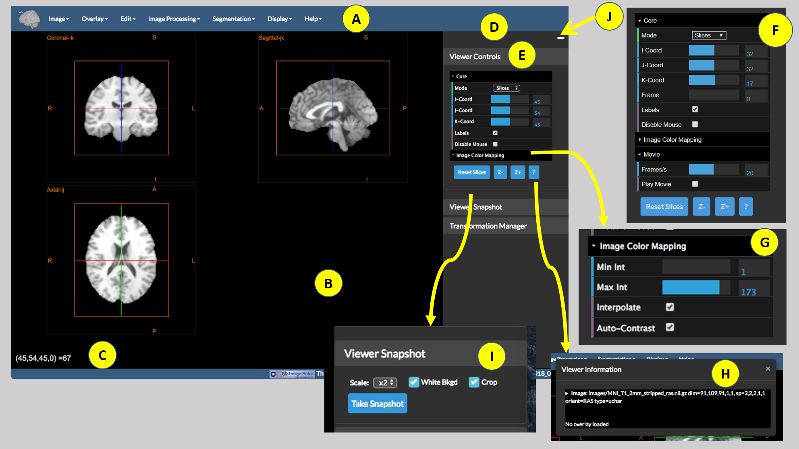
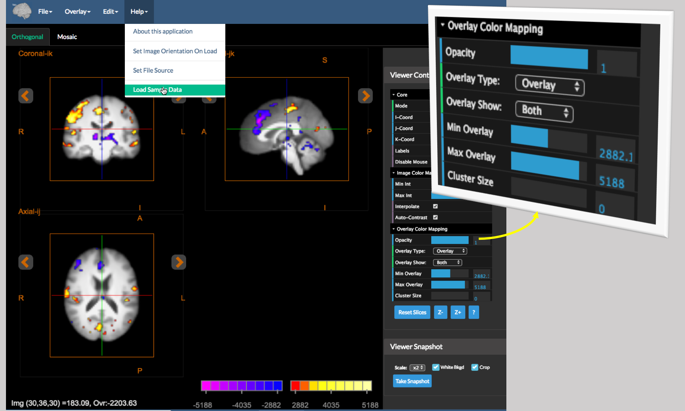
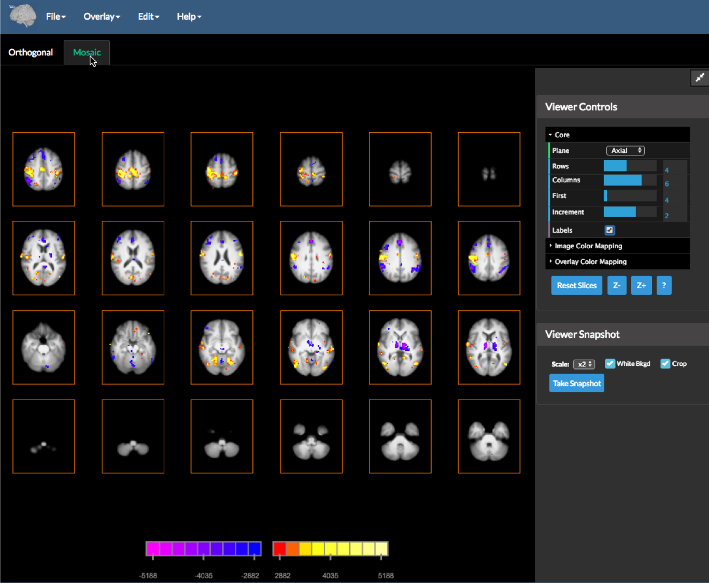

# BioImage Suite Web User Documentation

## Table Of Contents

* [Starting BioImage Suite Web](#starting-bioimage-suite-web) -- how to get and run the software.
* [Some Key Information](#some-key-information) -- information about configuring your browser and default image orientations.
* [The Orthogonal Viewer Application](#the-orthogonal-viewer-application) -- the "first" application with an explanation of how the viewers work (including colormapping etc.)
* [The Overlay Viewer Application](#the-overlay-viewer-application) -- an application optimized for displaying functional overlays.
* [The Image Editor Application](#image-editor) -- an application that can be used for interactive segmentation and VOI analysis of images.

__Note:__ This document and those linked to it contain the beginnings of the user documentation for [BioImage Suite Web](https://bioimagesuiteweb.github.io/webapp/). A brief introduction to the software can be found in this [presentation](https://bioimagesuiteweb.github.io/webapp/images/BioImageSuiteWeb_NIHBrainInitiativeMeeting_April2018.pdf). If you are looking for developer documentation, this may be found in [the doc directory of the source repository](https://github.com/bioimagesuiteweb/bisweb/tree/master/doc). _This is work in progress._

---

### Starting BioImage Suite Web

BioImage Suite Web consists of three major components

* [The web applications](https://bioimagesuiteweb.github.io/webapp/) which directly run in your browser with no installation required.
* Desktop applications using [Electron](https://electronjs.org/) which may be downloaded from our [download page](http://bisweb.yale.edu/binaries/binaries.html)
* Command line applications which may also be downloaded [from our download page](http://bisweb.yale.edu/binaries/binaries.html). This require a recent version of [Node.js](https://nodejs.org/en/). We recommend v 8.9 or later (but not 9 or 10).

This is the main page at [https://bioimagesuiteweb.github.io/webapp/](https://bioimagesuiteweb.github.io/webapp/)

BioImage Suite Web consists of a collection of applications (which is likely to grow over time.) The list can be accessed under the Applications menu (as shown) and snapshots and brief descriptions of each application can be seen in the carousel (slide show) at the top of the page.

From the menu you can also navigate to the downloads page, the documentation and the source code repository.

---

## Some Key Information

### Download File Location

When using BioImage Suite Web in a web browser all save operations are implemented as download operations, i.e the software creates the data output and initiates a download event. By default most browsers send all downloads to your Downloads directory which is completely unsuitable for using BioImage Suite Web as an analysis software. We recommend going under Settings in your favorite browser as shown below for Chrome:

You need to turn the option `Ask where to save each file before downloading` to `ON`.

For Safari on MacOS see the [description on this web page](https://apple.stackexchange.com/questions/264594/prevent-safari-10-x-from-auto-downloading-files).

### Image Orientations

The Viewers and commandline tools can load images in the [NIFTI-1](https://nifti.nimh.nih.gov/) `.nii.gz` format. A key component of the image is the image orientation. This relates the internal image coordinates to "world" coordinate space.

If we consider a 3-dimensional image matrix `F(i,j,k)` where `i`,`j` and `k` are the coordinate axes in the images where `i,j` are the in-plane directions and `k` is the slice axis. For example in the image shown above for Axial images, `i` is often Left->Right, `j` is Posterior->Anterior. The slice axis `k` is often Inferior->Superior. Such an image is described as having orientation __RAS__ where the letters stand for the direction of the individual axes i.e

* __R:__ i-axis to the RIGHT
* __A:__ j-axis to the ANTERIOR
* __S:__ k-axis to the SUPERIOR

RAS is probably the most common orientation for Neuroimaging research. An alternative orientation that is commonly used (and which the legacy BioImage Suite used) is `LPS` which is 180 degrees rotated w.r.t. RAS (flip i and flip j).

There are 48 (!) possible combinations of orientations. BioImage Suite Web can display all of these (at least as far as we have tested) but also provides the user with the option of converting images `on-load` to RAS or LPS to standardize. Under the Help menu if you select the option `Set Image Orientation on Load` the following GUI appears.

If you select either RAS or LPS then any image load will be repermuted to be in RAS or LPS orientation on load. The settings are stored either in the Browser Database or the text file ${HOME}/.bisweb for commandline and Desktop applications. This is a JSON key-value database file that may look something likes this:

In this case "orientationOnLoad" is set to "None" which preserves the image orientation as is.

---

## The Orthogonal Viewer Application

All BioImage Suite web applications share components and have a similar user interface. The picture below shows the `Orthogonal Viewer Tool`. This viewer consists of a single viewer plus some controls. All viewers in BioImage Suite Web can display two images:

1. The underlay "image" -- this is often the anatomical image and be loaded and saved from the `Image` Menu.
2. The "overlay" or "objectmap" image -- this is often a functional image or a segmentation image. This can be loaded and saved from the `Overlay` menu.

The application consists of the following parts:

* A. The Menu Bar -- this provides access to all algorithmic functionality in the application. 
    * `Image` -- functionality for loading and saving the underlay anatomical image
    * `Overlay` -- functionality for loading and saving (and clearing) the overlay functional image. 
    * `Edit' -- typically contains Undo and Redo functionality for image manipulation operations and tools to move images from overlay to image etc.
    * `Image Processing` -- this contains the image processing tools.
    * `Segmentation` -- this contains more modules to perform image segmentation. In the `Dual Viewer` application there is also a `Registration` menu that contains the image registration tools.
    * `Display` -- in this single viewer, this simply has an option to display information about the currently display image. In the `Dual Viewer` application there are additional options to set the relative size of the two viewers.
    * `Help` -- this contains the usual `About this Application` option plus options for setting user preferences.

* B. The Viewer (one application has two viewers). This can display the two images in either single slice or three-linked slice views. There is also a viewer component (see `Overlay Tool`) which displays multiple parallel sections of the same image.

* C. The image information under the cursor. As you click in the image, the current coordinates (i,j,k) of the image and the current intensity of the image (and the overlay if present) are shown here.

* D. The side panel containing viewer controls. 

* E. The `Viewer Controls` which allow the user to control how the image is displayed. 
    * `Mode` -- this selects single slice or three orthogonal slice view.
    * The `I-Coord`, `J-Coord`, `K-Coord` sliders select the `i,j,k` coordinates of the viewer crosshairs.
    * The `Labels` toggle shows and hides labels in the viewer (all text and lines.)
    * The `Disable Mouse` toggle locks the viewer from user mouse input. The cross-hairs may only be changed using the `I,J,K-coord` sliders.
    * The `Reset Slices` rests the viewer to default 'zooms'.
    * The `Z-` and `Z+` buttons perform zoom in and out operations. You may also zoom using the mouse wheel in the usual way.
    * The `?` button shows the current image information ('See H'). 

* F. In the case of a 4D image, there will be extra controls in the `Viewer Controls`. This include the `Frame` slider for slecting the frame and the `Movie` controls for playing a movie and setting the framerate.

* G. The image color-mapping controls. This set the windowing for the anatomical image. Values below 'Min Int' are to black (and also fully transparent) and intensities above 'Max Int' are saturated to white. The `Interpolate` flag can be used to allow WebGL interpolation or not (smoother images vs being able to see the actual voxels). Finally the `Auto-Contrast` toggle enables automatic windowing if this is desired. If there is a funtional image loaded, an additional set of controls called `Overlap Color Mapping` will appear. More on this below.

* I. This is the viewer snapshot tool. It can be used to save a snapshot of the current viewer in a png file. The three sub controls are:

*  `Scale` -- sets the size of the image in voxels relative to the size of the viewer. For publication quality set this to 'x5' (five times) or higher.
*  `White Bkgd` -- sets the viewer background to white instead of black.
* `Crop` -- if turned on automatically crops empty space in the viewer to give a more pleasing snapshot.
* `Take Snapshot` -- this actually invokes the code to acquire a snapshot.

* J. The `_` button at the top right of the sidebar can be used to minimize and restore the sidebar.

---

### The Overlay Viewer Application

All viewers can display overlays. The `Overlay Viewer` is particularly optimized for this task. This is shown below.

This is a dual viewer that shows functional overlays in both an `Orthogonal` (three orthogonal slice viewer shown above) and a `Mosaic` (multiple parallel slices -- see below) viewer which are synchronized to have the same color mapping scheme.

To try this out, open the application from the main BioImage Suite web page (under `Applications| Overlay Viewer`) and then under `Help`, select `Load Sample Data`. This will load a sample anatomical/functional image pair. (You may load your own images using `Image|Load Image` and `Overlay|Load Overlay`. As discussed above, once an overlay image is loaded, the `Viewer Controls` have an additional set of controls labeled `Overlay Color Mapping` (shown on the right). The controls here perform the following tasks:

* `Opacity` - the relative opacity for 0 (completely transparent) to 1 (fully opaque). Use this to partially show the anatomy under the functional map if desired.
* `Overlay Type` -- the overlay can be displayed using a number of different color maps. These are
    * `Objectmap` -- this is used for displaying sementation objectmaps. The overlay is rendered using a rainbow-like lookup table.
    * `Overlay` and `Overlay2` -- these are slightly different variants of colormaps used to display functional images. The mapping (explicitly shown in the colorscale in the viewer -- bottom right -- is performed as follows):
        * If `Overlay Show` is set to `Both` both positive and negative values are shown otherwise either only positive or only negative values are shown.
        * `Min Overlay` : parts of the image whose intensity is below this (in an absolute sense) is displayed in a completely transparent color (not shown effectively).
        * `Max Overlay` : values above these are saturated.
        * `Cluster Size` : if this is greater than 0 then cluster filtering is performed to eliminate `small` blobs.
    * `Red`, `Green`, `Blue`, `Orange`, `Gray` -- this display the image using an anatomical style mapping. This is useful for overlaying two anatomical images to check registration results etc. In this setting, no clustering is performed and the colorscale is hidden.

This viewer can also be switched to `Mosaic` view by clicking the `Mosaic` Tab (just below the menu).

This shows multiple parallel slices of a particular orientation (selected using `Plane`). You may set the number of rows and columns, the first slice and increment (which may be negative). The colormapping controls are identical to the orthogonal (3-slice view) and is synchronized between the `Orthogonal` and `Mosaic` tabs.

---
## Image Editor

#### Introduction

The Image Editor tool shown above is a tool to create and visualize interactive segmentations, as well as to correct existing segmentations (e.g. skull stripping). This tool shares much of the functionality of the [The Orthogonal Viewer Application](#the-orthogonal-viewer-application) with the following additions:

* Overlays are explicitly labeled as Objectmaps (i.e. the value in this overlay image is explicitly a tag for a region)
* The ability to edit the object maps using the "Paint Tool".
* Provision of selected set of modules (Create Objectmap, Morphology Operations, Regularize Objectmap, Mask Image) for modifying object maps.
* The integration of the VOI (`Volume-of-interest`) analysis tool that uses the current objectmap to analyze the underlying image (which could be a timeseries as opposed to just a static image).

#### Creating an Objectmap

One can create an objectmap on one of three ways:

* Load it from an existing binary file
* Create it by manually defining the regions using the `Paint Tool`
* Create it by thresholding the underlying image. The example above shows the use of the `Create Objectmap` tool (essentially a binary thresholding tool) to create the obejctmap.

#### Detailed Operations

Once an objectmap is n memory it can displayed and manipulated using tools provided in the `Image Editor` Tool. The figure above highlights five different pieces of functionality as follows:

* A: Overlay color mapping: Here we assume explicitly that the overlay is an objectmap hence the only display/color mapping option available is the `Opacity`. 
* B: The Paint Tool: this is the core of the BioImage Suite Web interactive segmentation tools. Essentially this is a smart paint-brush tool where the user selects a color (6 shown below plus more can be accessed by pressing the `...` button) and paints over the image to create/edit an objectmap.

The following is a brief description of the functionality included in this:

* The `Enable` toggle. If this is `on` then the paint tool receives mouse input and uses it to `paint` over the image (edit the objectmap). If this is turned to `on` the paint tool is highlighted with a red background color (as shown in the picture). 
* The `Overwrite` toogle. If this is `on` then regions already defined may be erased by painting over them. If not, one can only paint where the objectmap is `zero` or `background`.
* `3D Brush` -- if on the painting is done with a brush that extends to multiple slices, otherwise the image is colored only on the current slice. (This could be any of the three orthogonal slices shown in the viewer.)
* `Threshold` -- if on then the image is colored in, only if the intensity is between the `Min Threshold` and `Max Threshold` (selected below).
* `Connect` -- if on and if `threshold` is on then the paintbrush only fills in voxels between the thresholds and who are `connected` to the central voxel.
* `Brush Size` -- sets the brush size in voxels.
* The colorbar `[0][1][2][3][4][5][6][..]` allows the user to select the color to paint. The color `black` selected by pressing the  `[0]` button is the eraser, provided that `Overwrite` is `ON`.
* Finally the editor can perform undo and redo operations, as needed, using the `Undo` and `Redo` buttons.

C. The Morphology Operations Tool -- this performs mathematical operations such as `erode`, `dilate`, `median`, `connect` (seed connectivity from current cross-hairs) etc on 0/1 objectmaps. If the objectmap contains multiple colors then they will all be converted to 0 or 1.

D. The Regularize Objectmap Tool -- this magic tool performs markov random field regularization to smooth manually painted regions. It was developed for the construction of the Yale Brodmann atlas image. (You can load this under Obejctmap | Load Yale Brodmann Atlas.) To get a desired level of smoothness, set the smoothness value and press `Smooth`.

E. The Mask Image Tool -- this can be used to mask the underlying anatomical image with the objectmap to mask out all parts of the image outside the mask (if `Inverse` is set to `Off` ). Setting `Inverse` to `On` allows one to mask the region inside the objectmap. Before masking, the objectmap must be binarized by thresholding it using the threshold set using the `Threshold` slider.

Given an objectmap and a 4D image we can generate image timeseries plots as shown above. To invoke this control go to 'Objectmap | VOI Analysis'. By default, the graph shows the average intensity in each region over time. There are five buttons at the bottom of this which perform the following operations:

* Plot VOI Values -- this is the default operation. If the underlying anatomical image is 4D the result is a plot like the figure above. If it is a 3D image, then a bar chart is generated instead.

* Plot VOI Volumes -- This creates a bar chart of VOI region volumes.

* Export as CSV -- this outputs the data used in the plots as a comma-separated file (CSV) for import into Excel/Matlab etc. for more detailed plotting.

* Save Snaphot -- saves the current plot as a .png image file

* Close -- closes the VOI Timeseries plotter window.

