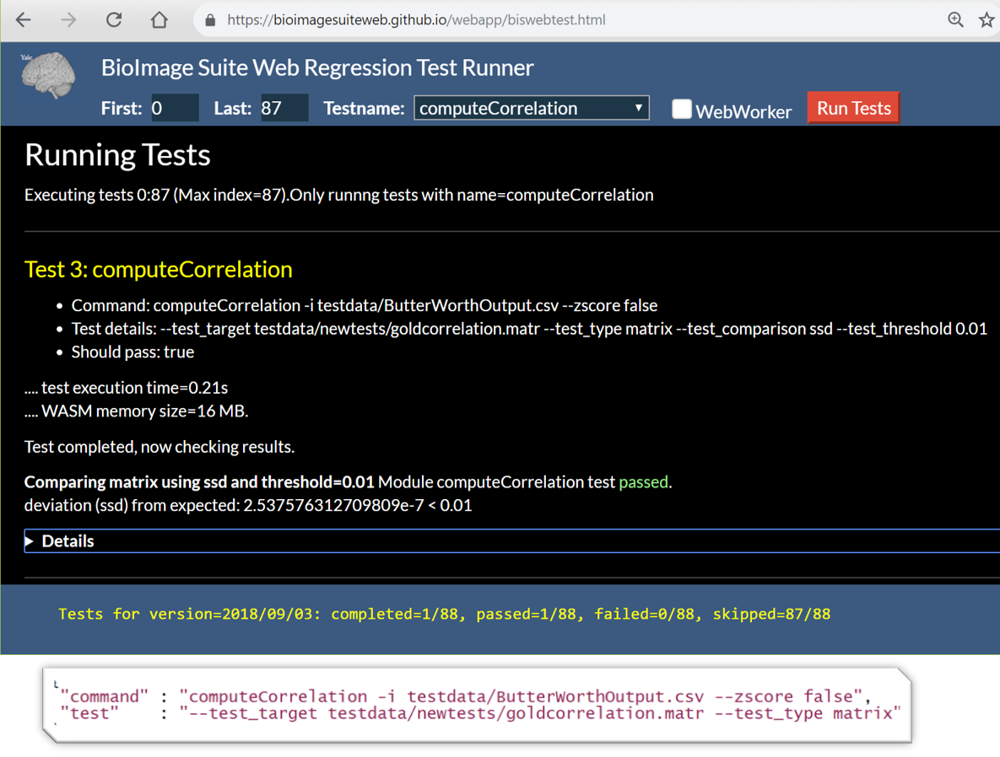
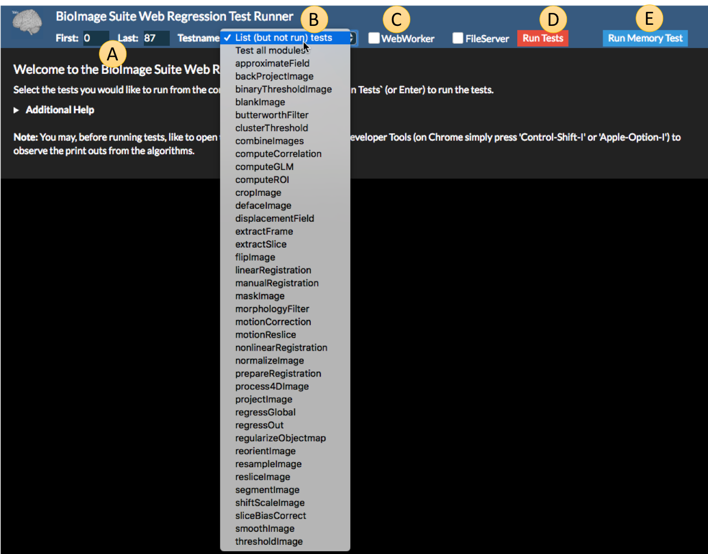
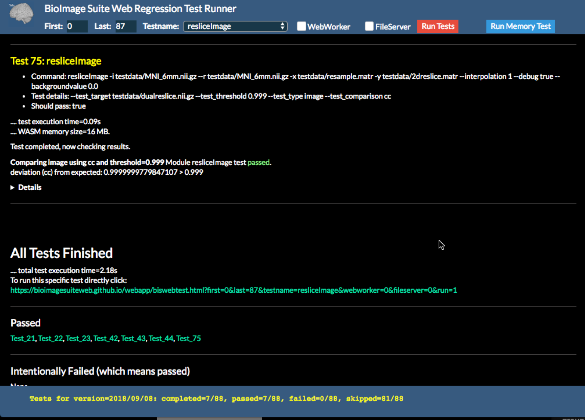
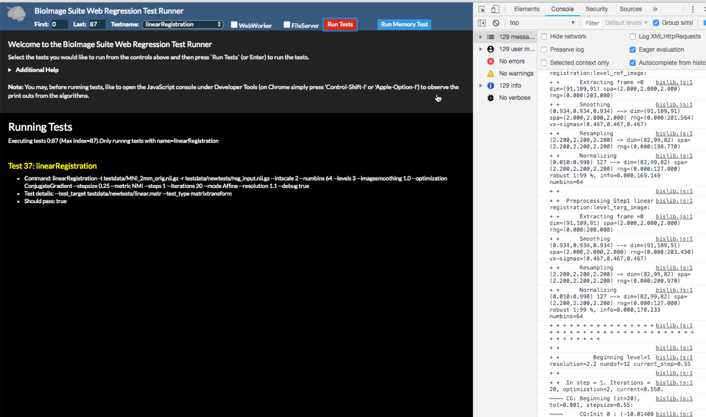
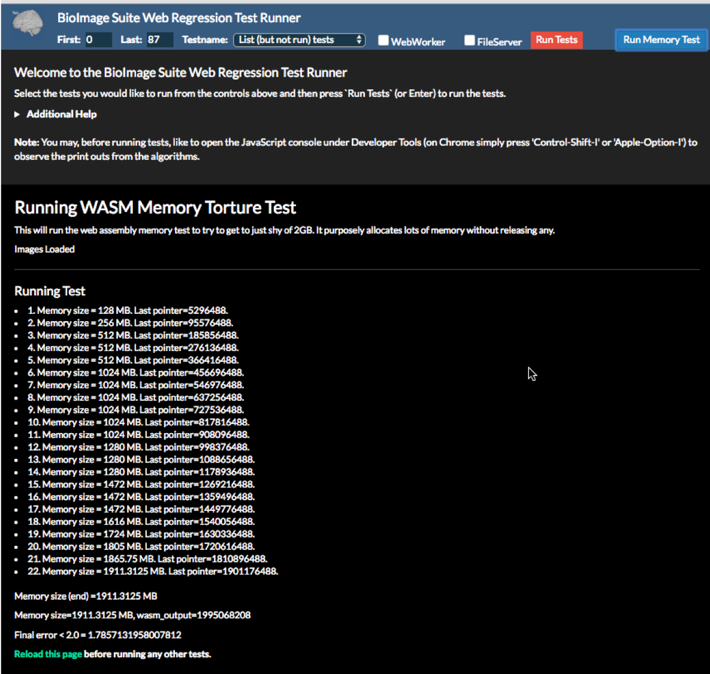

## Verifying BioImage Suite Web for your Environment

BioImage Suite, in a manner rare among software packages,
allows users to run the regression tests on their own computers using the
__pre-built__ version of the software. We provide a regression
testing application (see below) from which a user can select tests and
run them verify their own installation. This can help to detect problems between BioImage Suite and the user's browser, machine, operating system, etc. 

The tests are defined in a JSON file, an abbreviated entry of which is shown in Figure 2. For the curious, the complete list of tests can be downloaded [from this link](https://bioimagesuiteweb.github.io/webapp/test/module_tests.json).

_Figure 1 (top): A test running in the Web browser. Note the output pertaining to running the test under the 'Running Test' and 'Test 3' headers and the test results at the bottom._

_Figure 2 (bottom): An example of the JSON for one of the BioImageSuite regression tests._

Note that these same tests can be run from the command line from the BioImage Suite Web source tree by typing `make test`. See [the developer documentation](https://github.com/bioimagesuiteweb/bisweb/tree/master/docs) for more details. These tests consist of two groups: (i) low-level unit tests and (ii) higher-level module tests. Only the module tests can be run in the browser.

There are over 85 tests as of 9/18/18.
 
---

### Running Regression Tests in the Browser

First open the BioImageSuite Web Regression Testing Application from [https://bioimagesuiteweb.github.io/webapp/biswebtest.html](https://bioimagesuiteweb.github.io/webapp/biswebtest.html).

## Selecting Which Tests to Run

_Figure 3: The opening screen of the BioImage Suite Web Regression Test Runner with the module list expanded._ 

Specifying which tests to run works through using components `A` and `B`, which work as follows:

* `A` : `First` and `Last` — The test runner will begin running tests at the test marked first and stop running tests at the test marked last.
* `B` : `Testname` — Selects an individual module to test, or alternatively you can select all modules by choosing `Test all Modules`. You can also run a dummy test by selecting `List (but not run) tests`, which will list all available tests without running any.

Under `C` there are two checkboxes that control advanced options. If the `WebWorker` checkbox is enabled, then all modules are executed in a separate [Web Worker thread](https://developer.mozilla.org/en-US/docs/Web/API/Web_Workers_API/Using_web_workers). This tests our internal multithreading, which is currently not used in the production version of the software. The `FileServer` box is used to test the BioImage Suite File Server, which is currently not available for public use.

Finally, the buttons `D` and `E` run the tests. 

* `D` : `Run Tests` — This runs the tests selected by the filtering controls `A` and `B`.
* `E` : `Run Memory` — This runs the memory allocation test for WebAssembly (more on this below).

---

## Running Module Tests

_Figure 4: The results from a successfully tested module._

The figure above shows an example test run, where we chose to run all the tests of the module `resliceImage`, which reslices images from one coordinate space to another using a transformation. 

When the test is finished, the status bar at the bottom of the browser shows a summary of what happened (`completed 7/88, passed 7/88, failed=0/88, skipped=81/88`). The 81 skipped tests are thoses tests that do not involve this module and have not been executed.

Please note that a certain subset of the tests is designed to _intentionally fail_, so these tests returning errors should be expected.

The log for each test is printed on the webpage, and you can scroll up to see the results for each test. In addition, the `Details` tab at the bottom of each test can be expanded to show more details.

_Figure 5: A test with details expanded._

For some tests that take longer or generate more output, it might be useful to look at the print statements in the JavaScript console. In Google Chrome, this can be opened by pressing 'Control-Shift-I' (Windows/Linux) or 'Apple-Option-I' (Mac). This may show debug statements printed by the JavaScript code itself that will not be reproduced in the test running page.

_Figure 6: The webpage with the console expanded._

## Running the Memory Test

This will verify that your browser has the ability to allocate upto 2GB of RAM for running the modules implemented in C++ and compiled as WebAssembly (see [this document from the source tree](https://github.com/bioimagesuiteweb/bisweb/blob/master/docs/JStoWASM.md) for more information.) 

_Figure 7: The output of a successful memory test._

