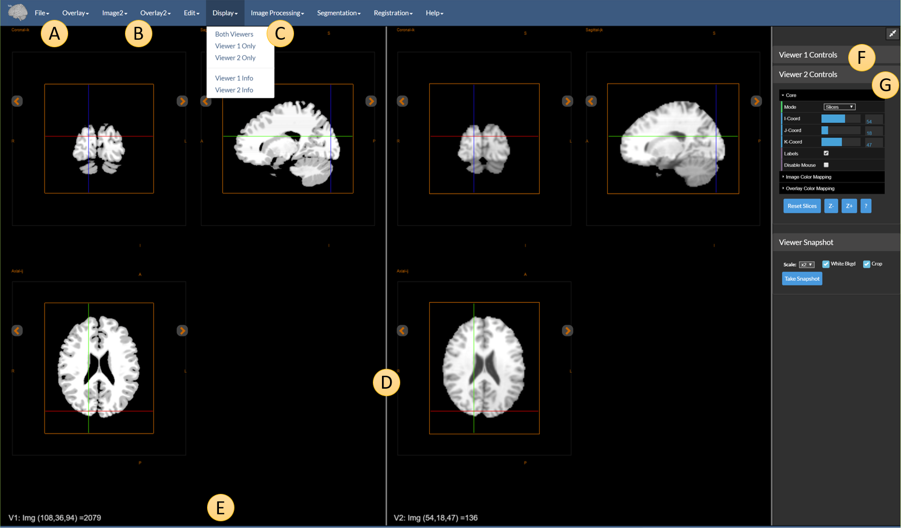
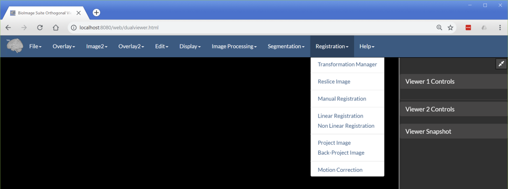
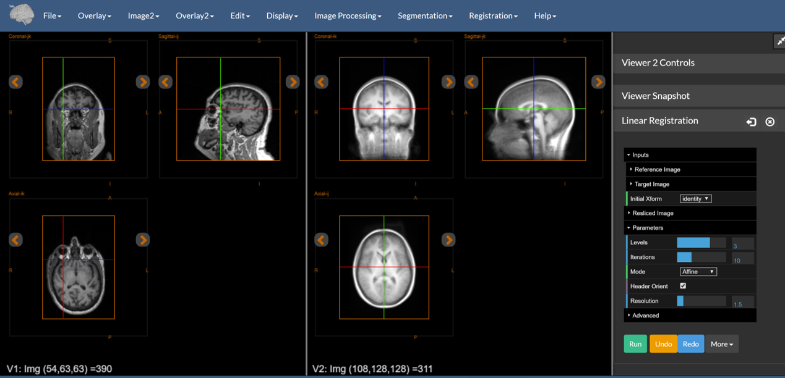
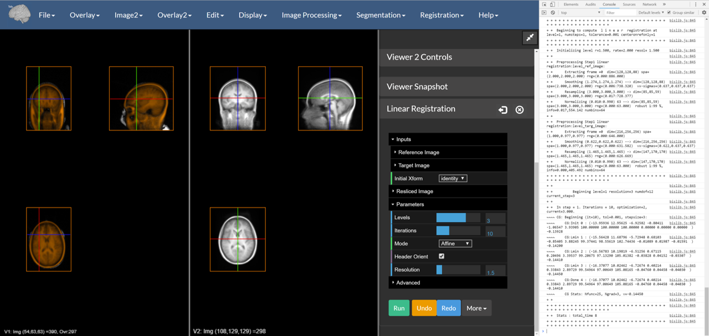
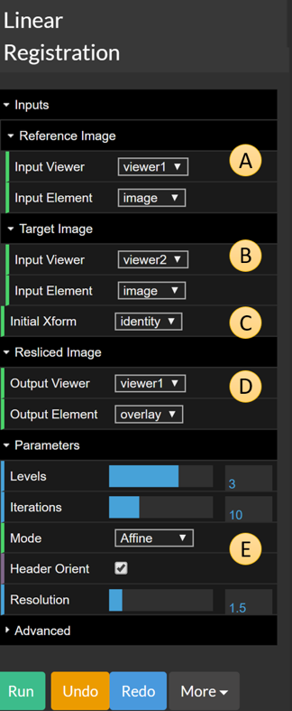
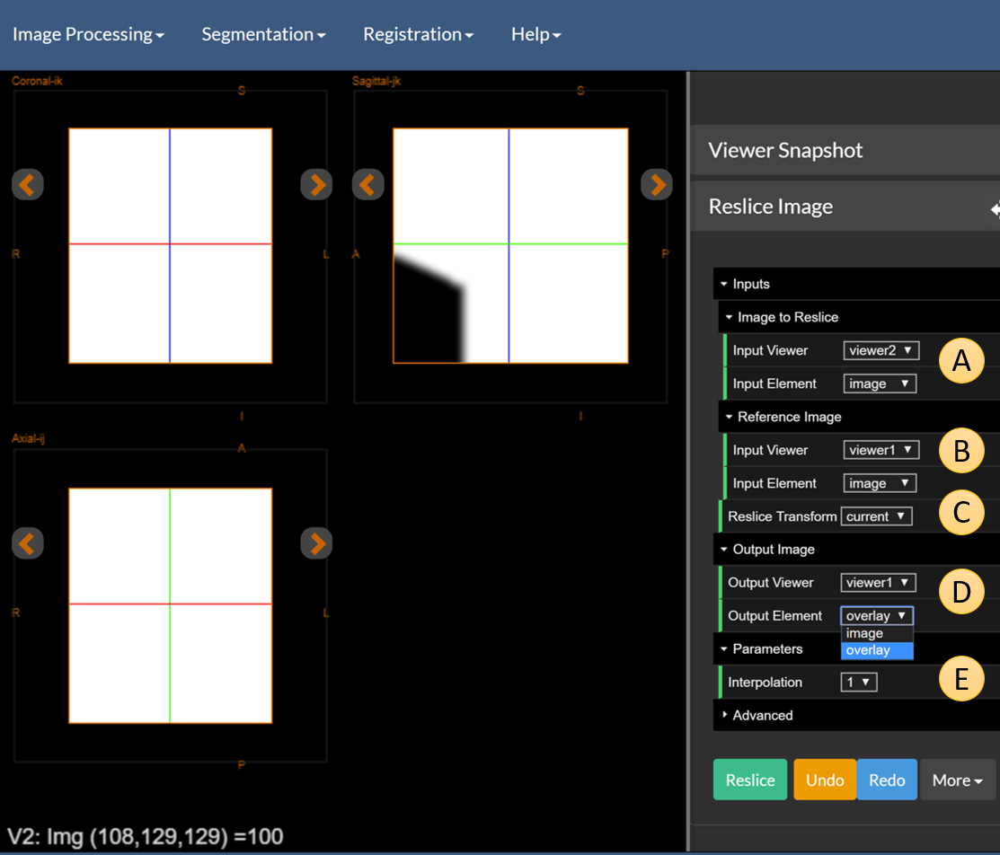
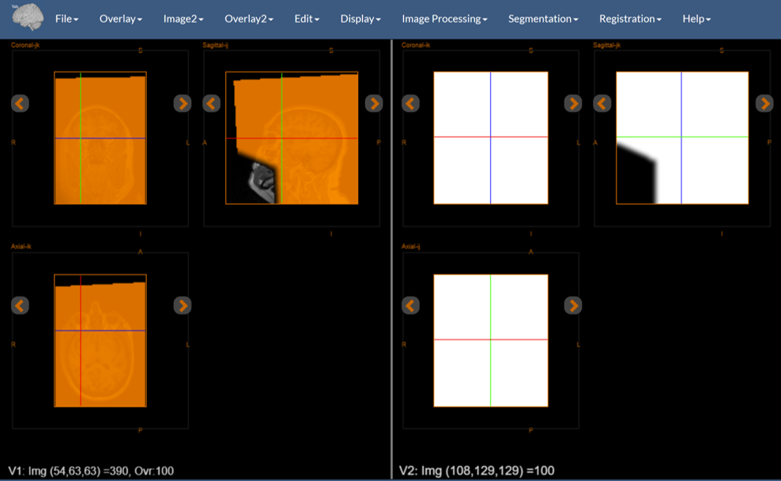

# The Dual Viewer Application

The [Dual Viewer](https://bioimagesuiteweb.github.io/webapp/dualviewer.html) application is the most complex tool in BioImage Suite Web. It allows the user to display two sets of images side-by-side with linked cursors and to manipulate images from either viewer, either separately or in combination. It is primarily targeted for image registration applications, though advanced users may also take advantage of the extra image display capabilities.

## Differences from the Single Viewer

Compared to the regular image viewer (described in the [this document](./viewers.md)), one notices the following differences, highlighted in the figure above:

The two viewers are separated by the dividing line `D`. The relative size of the two viewers can be adjusted by dragging this to the left or the right as desired.

* `A` and `B` -- there are two sets of menus for loading/saving images and overlays. `File` and `Overlay` are used to load/save images and overlays for `Viewer 1`. The menus `Image2` and `Overlay2` are used to load/save images and overlays for `Viewer 2`.

* `C` -- the `Display` menu which allows the user to show one or both viewers. 

* `E` -- at the bottom of the each viewer we have information about both (potentially pairs) of images, labelled as `V1` (Viewer 1) and `V2` (Viewer 2).

* `F` and `G` -- each viewer has its own set of viewer controls that can be used to manipulate the image display of each viewer independently. The cursors (viewer cross hairs), however, are linked (we perform coordinate conversions in mm) unless the `Disable Mouse` option is turned on, in any particular viewer.

## Image Processing and Segmentation Tools

These are identical in use to what was described for the single viewer -- see the documents [Image Processing](tools/imageprocessing.md) and [Segmentation Tools](tools/segmentation.md). We again highlight here, that in the dual viewer one can select the input images in finer detail. As mentioned in the description of the image processing tools, in the Dual Viewer application, there is an additional set of options for setting the `input` and the `output` image. As shown in the figure below, both the input and the output have an additional "Viewer" tab. In this way, one can choose to `flip` the image in viewer 1 and send the output to `viewer 2` or any one of many other possible combinations. The rest of the functionality is identical.

.

## The Registration Tools

The key extra functionality in this tool is the inclusion of the registration tools. These can be accessed from the `Registration` menu as shown below:

The options are as follows:

* `Transformation Manager` -- this shows the transformation manager which is where the registration tools store their output transformations. The transformations in this tool are also used by the tools which transform images (in some way) as inputs.

* `Reslice Image` -- this can be used to reslice an input image using a transformation. There are three inputs here. The `reference` image (i.e. the image to which our image will be resliced to), the `input` image (the image to be resliced) and the `transformation` that will be used for the reslicing.

* `Manual Registration` -- this can be used to create a manual rigid+scale transformation to manually align two images . The result of this is often used to initialize more automated registrations.

* `Linear Registration` -- this can be used to run a linear (rigid,similarity,affine) intensity-based transformation to match two images. (This is the basis for the [Deface Image Tool](./tools/defacing.md).

* `Non Linear Registration` -- this can be used to run a non-linear B-spline FFD registration between two images. (This can be slow!)

* `Project` and `Back-Project` Image -- these are options used to map 2D optical and 3D MRI images developed for the needs of a project at Yale.

* `Motion Correction` -- this can be used to perform motion correction (serial rigid registration) on a 4D image.

## Running a Linear Registration

This is often a straight-forward process. First load the reference image in `Viewer 1` and the target image in `Viewer2`. The goal is to create a transformation that can be used to reslice the target image to match the reference image.

### Loading the images to register

A. Under the `File` menu, use the `Load Image` option to load the reference image.
B. Under the `Image2`menu, use the `Load Image` option to load the target image.

For this example, we use the images using to test the [Deface Image Module] available from these links:

* [Reference Image](https://github.com/bioimagesuiteweb/bisweb/blob/master/test/testdata/deface/sag_2mm.nii.gz)
* [Target Image](https://github.com/bioimagesuiteweb/bisweb/blob/master/web/images/mean_reg2mean.nii.gz)

Once you click on these links, use the "Download" button to download the images.

Once the images are loaded, open the `Linear Registration` tool from the `Registration` menu. You should see a view similar to the figure below.

Note that the two images have different orientations. The one on the left is sagital whereas the one on the right is axial. The registration tools can handle this type of reorientation directly.

### Computing the Registration

C. In the registration tool, set the `Mode` parameter to `Affine`.
D. In the registration tool, click the `Run` button.

At this point you may want to observe the computation by opening the JavaScript console in your browser. See the [testing document](./biswebtest.md) for more information on this.

At the end (if everything goes well, and if you had opened the JavaScript console) you will be presented with something like the following

The resliced version of the input image is overlaid over the reference image using an `Orange` colormap. This can be saved under the `Overlay` menu. If instead, you wish to get to the actual transformation, you may access it using the transformation manager (open this from the similarly named option under the `Registration` menu). We will discuss this next:

## The Transformation Manager 

This has the following appearance:

This is a complex control that stores multiple transformations. These can be loaded from disk using the `Add` button below, or created as a result of some operation. The list of all transformations appears in the drop down menu `A`.

The current transformation is described in the text box `B`. All algorithms that require a transformation, __will use this current transformation__ as their input (if the user selects this, more on this later).

The buttons in bottom row perform the following:

* `Add` -- this loads a new transformation from a file and adds it to the manager's list.
* `Save` -- this saves the current transformation to a file
* `Delete` -- this removes the current transformation from the manager.
* `Rename` -- this renames the current transformation to give it a simpler name. 
* `Invert` -- if the current transformation is a linear one (i.e. can be represented by a 4x4 matrix), this can be used to invert the transformation.

Finally we have the two buttons marked as `D` and `E`. The arrow button `D` can be used to move the transformation control from the right sidebar of the viewer to the left sidebar (which will appear if not present). The close button `E` can be used to close the control and remove it from the sidebar.

_Note:_ the file format that is used for the transformations is, by default, a JSON-style file unique to BioImage Suite web. If you desire to use legacy BioImage Suite (`.matr` or `.grd` formats), you will need to rename the transformation (using the `Rename` button) to have this extension prior to saving. 

## Back to the Linear Registration Computation -- how was this performed?

Let us now examine the options for the linear registration tool (see figure above). There are five different items that are worth highlighting, labelled as `A` to `E` in the figure above:

* `A` -- the reference image. By default this comes from `Viewer1`, `image`. 
* `B` -- the target image. By default this comes from `Viewer2`, `image`.

Hence loading the images into Viewer 1 and Viewer 2, placed them in the default locations. One could easily have loaded the target image into Viewer 1 `overlay` and then set the target image options (`B`) to point there.

* `C` -- the initial transformations. This is one of `identity` (i.e. none used) or `current`. If `current` is specified, then the current transformation in the Transformation Manager will be used as the intial transformation.

* `D` -- the resliced output image. This is where, once the registration is done, the resliced image (i.e. the target image resliced by the output transformation to match the reference image) will be sent. The default has it going to the `Viewer`, `overlay`, hence the `brown`-colored overlay seen above.

Finally we have the registration options. For the most part the defaults will work. These are shown in `E`. The ones shown have the following impact:

* `Resolution` -- this is the factor that controls the reduction in resolution (from the resolution of the reference) used to compute the registration. A resolution factor of `1.5` implies that if the reference image had resolution 1x1x1 mm, then the registration will be computed at 1.5x1.5x1.5 mm.
* `Levels` -- the number of multiresolution levels used for the optimization. We typically use 3 levels. The registrations first performed at a coarse resolution and then refined to better resolution (with the final level using the resolution described in the previous bullet).
* `Iterations` -- the maximum number of iterations at each level. 10 - 15 is a good range here.
* `Mode` -- this sets the mode of the linear registration. The most common settings are `Rigid` (account for changes in position and orientation) and `Affine` (Rigid+Shear+Scale).

Finally the option `Header Orient` -- if selected -- uses the orientation matrices of the two images to perform an initial alignment.

There are more options under advanced which will not be described here in any detail. The most important of these is metric. The default value of this is `NMI` (normalized mutual information). Other options include SSD (Sum-of-squared differences) and `CC` (cross-correlation).

## Reslice Image

Consider the scenario that a registration is computed between two images `I` and `J` so that it can be used to reslice a third image `K` to match `I`. Obviously `J` and `K` must live in the same coordinate space. Going back to the defacing example, we will use the estimated tranformation to reslice the mask used for image defacing to match our image. 

A. Load the mask into Viewer2 as image. You may [download this from this link](https://github.com/bioimagesuiteweb/bisweb/blob/master/web/images/facemask_char.nii.gz).

B. Open the `Reslice Image` tool from the `Registration` Menu.

You will see a view (we show the right-half of the dual viewer application) that looks like the figure above. (The image shown is the mask). There are five items to highlight here, labeled `A` to `E` in the figure above.

* `A` -- the image to reslice. This is the mask which is in `Viewer2` as the `image`. The defaults are fine. This is the equivalent of image `K` in the previous paragraph.
* `B` -- the reference image, which is the image that we want to reslice our input to match. This is image `I` of the previous paragraph.
* `C` -- the reslice transformation. This is either `current` -- the current transformation from the `Transformation Manager` or `identity`.
* `D` -- the output location. We will set this to be the overlay of Viewer 1.
* `E` -- the interpolation. This can take 3 values: '0' = Nearest Neighbor, '1' = Linear and '3' is cubic. Select linear for now here.

Pressing the `Reslice` button will reslice the mask as shown below:

One can then use the `Mask Image` tool under the `Segmentation` menu (see the description of the [Segmentation Tools](tools/segmentation.md)) to mask the anatomical image etc. 

## NonLinear Registration

This uses a B-Spline FFD Registration method deriving from [Rueckert 1999](https://www.ncbi.nlm.nih.gov/pubmed/10534053). There are several options, the most important of which is control point spacing `CP-spacing` which defines the flexibility of the transformation. _More to come._

