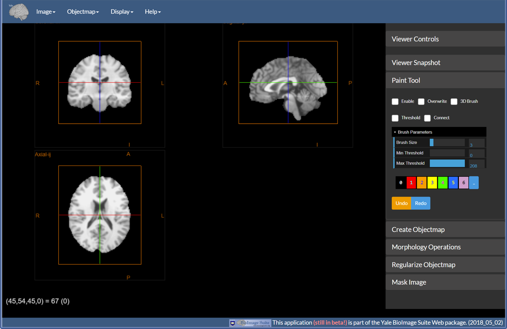
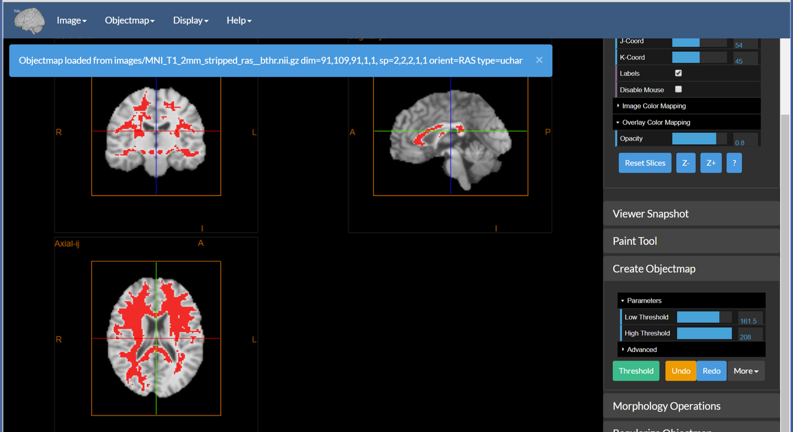
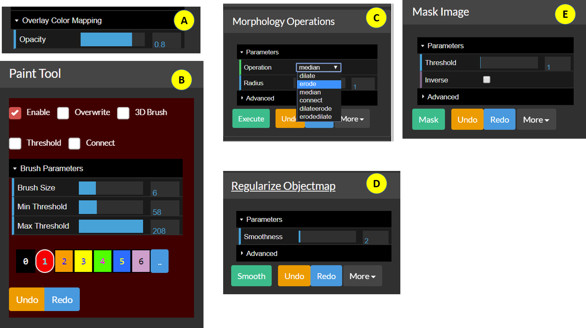
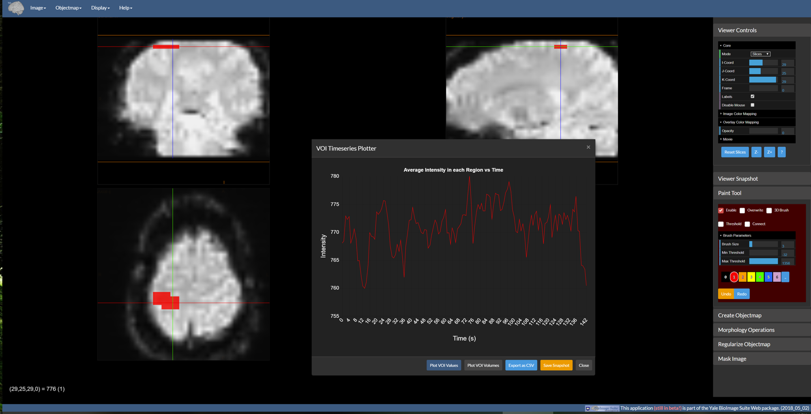

## Image Editor

<iframe width="695" height="391" 
src="https://www.youtube.com/embed/UsjMONux0co" frameborder="0" allow="accelerometer; autoplay; encrypted-media; gyroscope; picture-in-picture" allowfullscreen></iframe>

----

#### Introduction

_Figure 1: The image editor with the tools dropdown expanded and the Paint Tool displayed._ 

The [Image Editor](https://bioimagesuiteweb.github.io/webapp/editor.html) tool shown above is used to create and visualize segmentations interactively, as well as to correct existing segmentations (e.g. skull stripping). This tool uses the core orthogonal viewer described in [Displaying Images](viewers.md). It has the following additional features:

* Overlays are labeled as Objectmaps, i.e. the value in this overlay image is explicitly a tag for a region.
* The ability to edit the object maps using the `Paint Tool`.
* Provision of selected set of modules for modifying object maps. These include `Create Objectmap`, `Morphology Operations`, `Regularize Objectmap`, and `Mask Image`.
* The integration of the volume-of-interest (VOI) analysis tool that uses the current objectmap to analyze the underlying image. VOI analysis will work with both a timeseries and a static image. 

#### Creating an Objectmap

_Figure 2: A sample image thresholded using the Create Objectmap tool built into the editor._

You can create an objectmap in one of three ways:

1. Load it from an existing binary file. (Under `Objectmap` -> `Load`)
2. Create it by manually defining the regions using the `Paint Tool`
3. Create it by thresholding the underlying image. Figure 2 shows the output of `Create Objectmap`. Note that this tool essentially performs a binary threshold.

#### Detailed Objectmap Operations

_Figure 3: The individual components of the Image Editor._

Once an objectmap is in memory it can displayed and manipulated using tools provided in the Image Editor `Tools` menu. 

* A: Overlay color mapping — The editor explicitly assumes that the overlay is an objectmap, hence the only display/color mapping option available is the `Opacity`. 
* B: The `Paint Tool` is the core of BioImage Suite Web's interactive segmentation tools. Essentially, this is a smart paintbrush tool where the user selects a color and paints over the image to create/edit an objectmap. The following is a brief description of the functionality included in this:

  * `Enable` — If this is `On` then the paint tool receives mouse input and uses it to paint on the viewer's objectmap. 
  * `Overwrite` — If this is `On` then regions already defined may be erased by painting over them. Otherwise, you can only paint where the objectmap is `zero` or `background`.
  * `3D Brush` — If this is `On`, painting is done with a brush that extends to multiple slices, otherwise the image is colored only on the current slice. This will work for any slice in the viewer.
  * `Threshold` — If `On` then the image is colored in only if the background intensity is between the `Min Threshold` and `Max Threshold`.
  * `Connect` — If `On` and if `Threshold` is on then the paintbrush only fills in voxels between the thresholds that are 'connected' to the central voxel.
  * `Brush Size` — Sets the brush size in voxels.
  * `[0][1][2][3][4][5][6][..]` — Selects the color to use while painting. The color `black`, selected by pressing the `[0]` button, is the eraser provided that `Overwrite` is `On`. `[..]` will display a menu containing more colors.
  * `Undo` and `Redo` buttons — Perform undo and redo operations.

C. The `Morphology Operations` tool — This performs morphological image processing operations such as `erode`, `dilate`, `median`, and `connect` (seed connectivity from current cross-hairs) etc. on 0/1 objectmaps. If the objectmap contains multiple colors then they will be converted to 0 or 1.

D. The `Regularize Objectmap` tool — Performs Markov Random Field Regularization to smooth manually painted regions. It was developed for the construction of the Yale Brodmann Atlas, which can be loaded under `Obejctmap` -> `Load Yale Brodmann Atlas`. To get a desired level of smoothness, set the smoothness value and press `Smooth`.

E. The `Mask Image` tool — This can be used to mask the underlying anatomical image with the objectmap to mask out all parts of the image outside the mask. Setting `Inverse` to `On` will mask the region inside the objectmap instead. Before masking, the objectmap must be binarized by thresholding it using the threshold set using the `Threshold` slider.

#### VOI Analysis Tools

_Figure 4: The VOI analysis window displayed over the viewer._

Given an image and an objectmap, we can generate plots of VOI image data. If the image is 4D, this tool will instead generate image timeseries plots as shown above. To invoke this control go to `Objectmap` -> `VOI Analysis`. By default, the graph shows the average intensity in each region over time. There are five buttons at the bottom which do the following:

* `Plot VOI Values` — This is the default operation. If the underlying anatomical image is 4D the result is a plot like the figure above. If it is a 3D image, then a bar chart is generated instead.
* `Plot VOI Volumes` — Creates a bar chart of VOI region volumes (in mm^3).
* `Export as CSV` — Outputs the data used in the plots as a comma-separated file (CSV) for import into Excel, Matlab, etc. for more detailed plotting.
* `Save Snaphot` — Saves the current plot as a `.png` image file.
* `Close` — Closes the VOI Timeseries plotter window.

