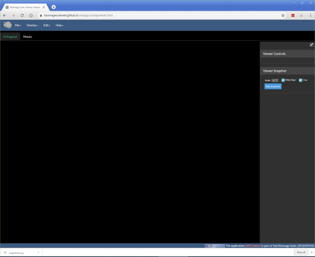
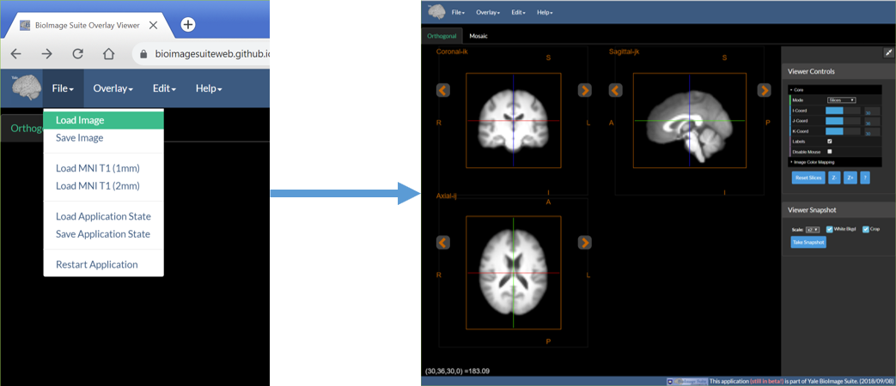
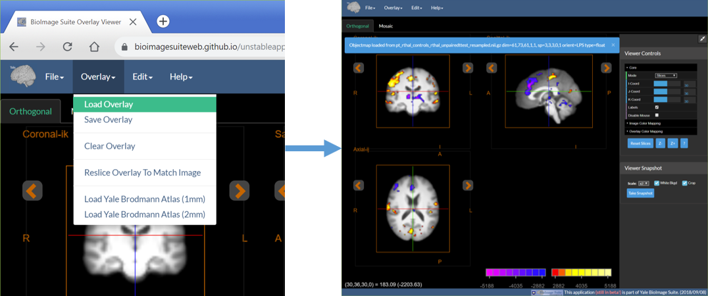
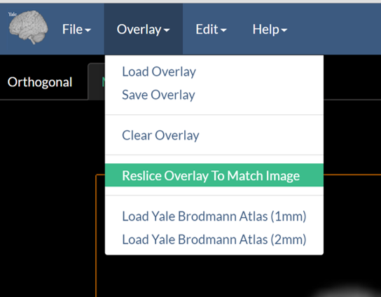
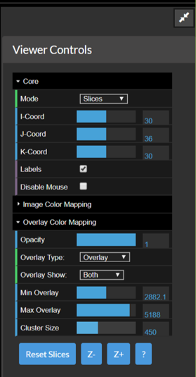
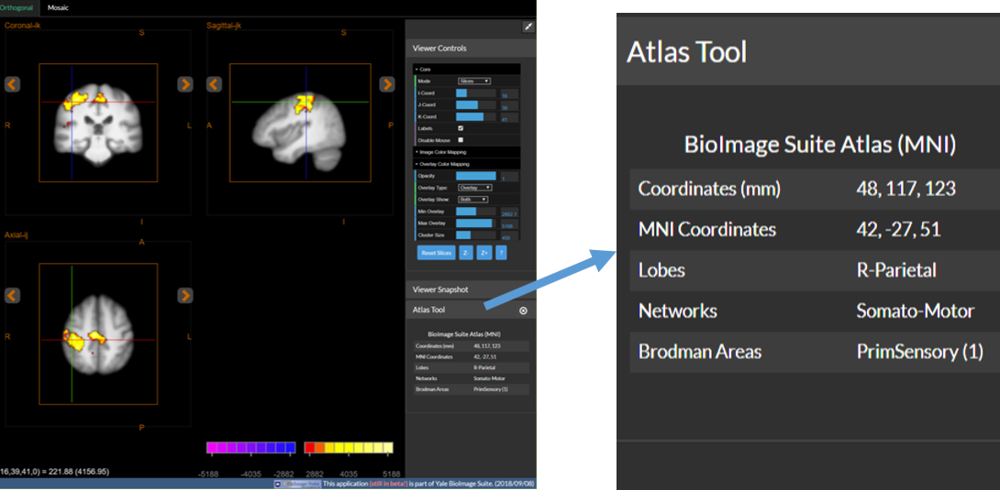
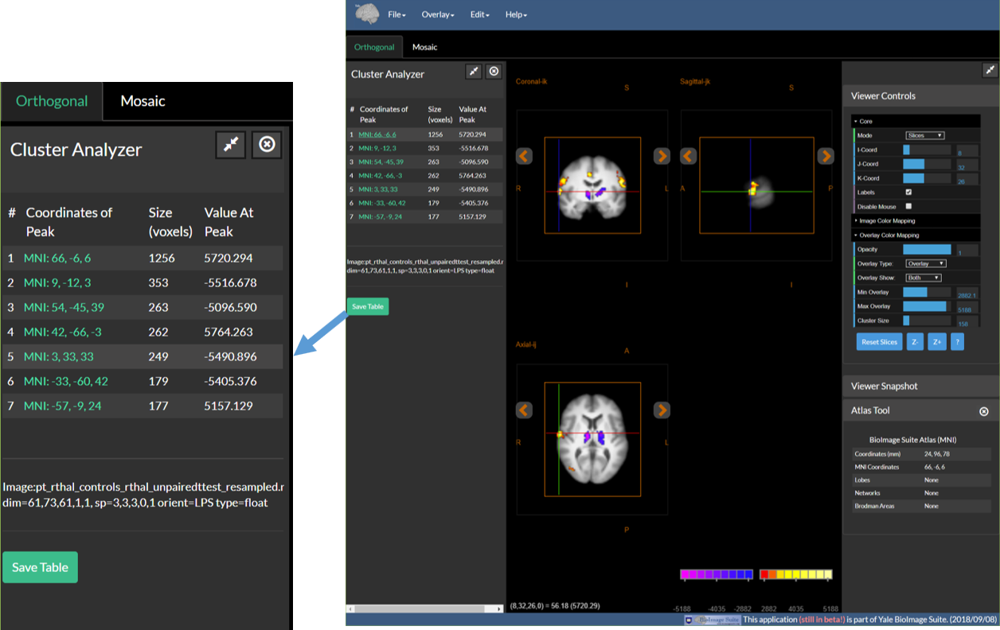
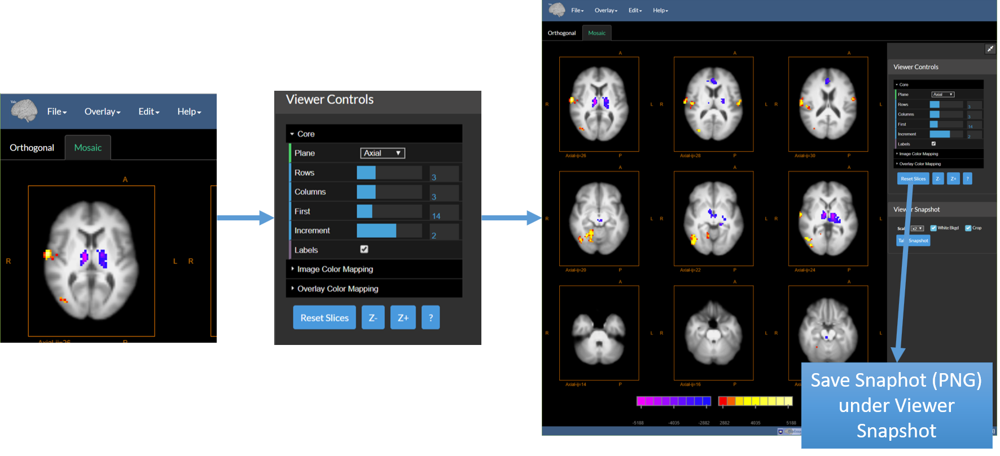

# Live Figures

<iframe width="695" height="391" 
src="https://www.youtube.com/embed/zWS68aOWUBQ" frameborder="0" allow="autoplay; encrypted-media" allowfullscreen></iframe>

---

## Usual Workflow for Saving Figures

In general, researchers, once they are done with their analyses create figures (such as the own below) to show their results. These are static figures (e.g. png,tiff) and can not be examined in any way to look at other slices, or adjust the thresholds etc.

To do this in BioImage Suite Web, one would:

* Load anatomical image.
* Overlay functional image.
* Create overlay by setting thresholds (both functional and cluster size).
* Save tiff image (e.g. the figure above).
* Email static tiff image or include it in a paper.

__Problems with this Approach:__

As alluded to above, this approach has a number of problems such as:

* Result is static.
* One can not change the location of the slices.
* One cannot change the thresholds.
* One can not examine the data in any detail other than the description provided in the caption.

__Solution: Live Figures in BioImage Suite Web__

We describe here a solution this problem: `Live Figures`. In BioImage Suite Web, we can create a `dynamic` or `live` figure that allows the recipient/viewer to interact with your results and examine them as if they were sitting at your workstation when you created the figure. We describe the procedure for these below. Naturally you can also create static figures by using the "Viewer Snapshot Tool"

## How to create a Live Figure

This is the overall procedure:

1. Load anatomical image
2. Overlay functional image
3. Create overlay by setting thresholds (both functional and cluster size)
4. Save “Application State File” (.biswebstate). This includes:
    * The images
    * The thresholds
    * The viewer configuration
5. Email the state file
6. Open it in BisWeb Overlay Viewer and interact with the data
7. Change views, thresholds etc.
8. Regenerate static views

### 0. Open Overlay Viewer

1. Go to bioimagesuite.org
2. Open the [Overlay Viewer](https://bioimagesuiteweb.github.io/webapp/overlayviewer.html). You should see the following application:

__Note__: The overlay tool is described in more detail in [this document](../overlayviewer.md)

### 1. Load Anatomical Image

1. Under the File menu select Load image. 
2. Then select the appropriate image file (in NIFTI-1 .nii or .nii.gz) format and load

### 2. Load Functional (Overlay) Image

1. Under the Overlay menu select Load Overlay
2. Then as before select the appropriate image file

### 3. (Optional) Reslice Overlay to Match Anatomical Image

Often the overlay image has lower resolution than the antomical image. For example functional images may have a resolution of 3mm whereas the underlying anatomical image may have a resolution of 1mm. While BioImage Suite Web can overlay images of different resolutions automatically, one will get a higher quality view if they reslice (resample) the functional image to match the resolution of the anatomical image. This is accomplished by using the "Reslice Overlay to Match Image" option under the Overlay menu as shown below.

### 4. Adjust Display Thresholds 

Under Viewer Controls (far right of the viewer) -- figure below.

1. Expand the Overlay Color Mapping Section
2. Set the Parameters
    * Opacity – controls how opaque the functional image should be (1.0=fully opaque)
    * Overlay type – select Overlay or Overlay 2 for two different colormaps
    * Overlay show – whether to show positive activations, negative activations or both
    * Min Overlay – anything below this will not be shown (rendered as completely opaque)
    * Max Overlay – anything above this will be saturated
    * Cluster Size – activation clusters of smaller size than this will be hidden

### 5. (Optional) Use the Altas Tool to examine the data.

1. Open the Atlas Tool by using the `Atlas Tool` option under the `Edit` menu.
2. Navigate to different positions in the viewer by clicking in the image, or by adjusting the sliders in Viewer Controls.
3. The Atlas Tool shows real time info about the point under the crosshairs.

### 6. (Optional)  Use the Cluster Tool to Examine the Data

1. Open the Cluster Tool using the ``Cluster Tool` option under the `Edit` menu.
2. Cluster Threshold the functional map by setting cluster size in the Viewer Controls -- see Step 4.
3. Once a cluster threshold is set, the cluster tool will automatically list the clusters that survive the thresholds (or the largest 25 if there are more)
4. Click on the coordinates (in green) of any cluster to navigate to the peak activation inside this cluster

### 7. (Optional) Generate a "Mosaic" View

1. Select the Mosaic Tab under the main menu (See the figure below on the left)
2. Adjust the Display Options under Viewer Controls -- this sets the number of image slices to display and their arrangment.

### 8. Once done: Save the Application State

* Save this using the option “Save Application State” under the File Menu.
* This will create a large file containing everything!

### 9. Send the File to a Colleague|Collaborator ...

* They open the Overlay Viewer in their own browser
* Under the File Menu the use the Load Application State to load the file you sent them
* Then your figure (including thresholds, cross hairs etc. appears!)

