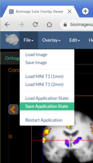
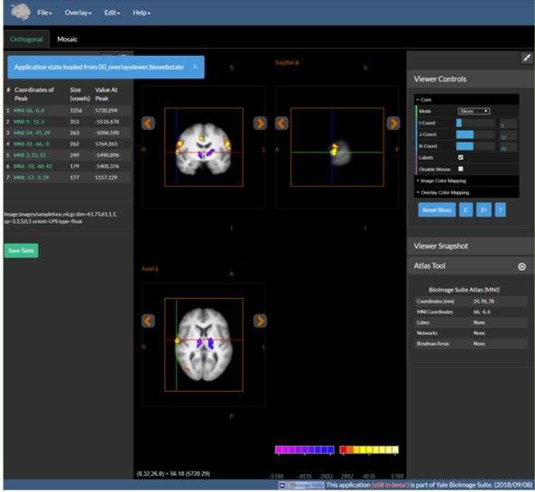
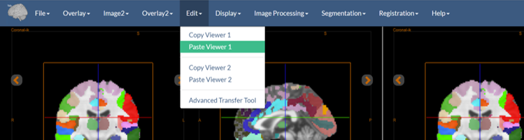
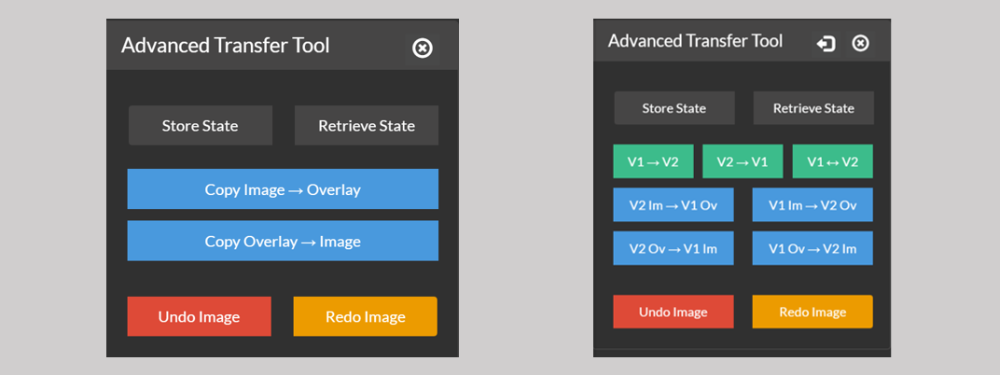

# Advanced Functionality

## Application State

Most of the tools in BioImage Suite Web have the ability to save the state of the entire application to a file and read it back in again. For example, in the overlay viewer we can load our data, create our visualizations and then save everything using the option “Save Application State” under the File Menu.

This file can then be reloaded later (by you, or by a collaborator) to restore the application. Open the same application (e.g. the OverlayViewer in this case) and then under the `File` Menu the use the `Load Application State` to load the file. Then your display (including thresholds, cross hairs etc.) will repear as it was when you save it as shown below:

The same applies to the Connectivity Viewer and other tools.

---

## Copying and Paste-ing Viewers

Each application in BioImage Suite has one (or in the case of the [Dual Viewer](../dualviewer.md) two) viewer components. These can be moved from application to application. For example, open the [overlay viewer](https://bioimagesuiteweb.github.io/webapp/overlayviewer.html?load=https://bioimagesuiteweb.github.io/webapp/images/viewer.biswebstate) and load the sample data under the `Help` menu. (The link given will do both in one go!)

Then under the `Edit` menu, select the `Copy Viewer` function. This will store the underlay image, the overlay image, and the viewer configuration (cross hair location, colormaps etc.) in the browser's cache (in the [IndexedDB database](https://developer.mozilla.org/en-US/docs/Web/API/IndexedDB_API) that is built into modern browsers).

Then open another viewer (e.g. the [Orthogonal Viewer](https://bioimagesuiteweb.github.io/webapp/viewer.html) and under the `Edit` menu select `Paste Viewer`. Your viewer state from the other application should now appear in this viewer.

The viewer state clipboard is preserved across sessions (assuming you are using the same browser) unless you clear the Application Cache.

In the dual viewer tool, we have a slightly more complicated arrangement, given that we have two viewers. Here there are two copy and paste options, one for each viewer. One can simply do "copy viewer 1" and "paste viewer 2" to duplicate the contents of Viewer 1 to Viewer 2 (if desired).

---

## Transfering Images -- the Advanced Transfer Tool

In the `Viewer` and `Dual Viewer` applications there is a special tool (accessible under the `Edit` menu) labeled `Advanced Transfer Tool` (see the figure above for the menu entry). This is shown below in its two configurations (left for single viewer, right for dual viewer)

This allows the user to copy an image (or a whole viewer) from one location to another. For example, in the single case we have two options:

* Copy Image->Overlay -- this will copy the image shown as underlay in the viewer to the overlay.
* Copy Overlay->Image -- this will do the reverse.

The 'Undo Image' and 'Redo Image' options will attempt to undo or redo the last procedure.

In the dual mode, we can copy whole viewers (or even swap them) using the options 'V1->V2', 'V2->V1' and (swap) 'V1<->V2' (the green buttons)

The copy image to image has four options as can move images from one viewer to another e.g. "V2 Im->V1 Ov" will copy the image from viewer 1 to the overlay of viewer 2.

Finally the two buttons at the top 'Store State' and 'Retrieve State' can be used to store and retrieve the viewer configuration (__excluding the images__ for later use). This allows the user, for example, to store the current cross-hair positions and colormap for use later. 

_Note:_ The overlay viewer and editor tools have a simplified version of this tool labeled `App State Manager` (accessible from the `Edit` menu ) which provides subset of the functionality of the advanced transfer tool.

