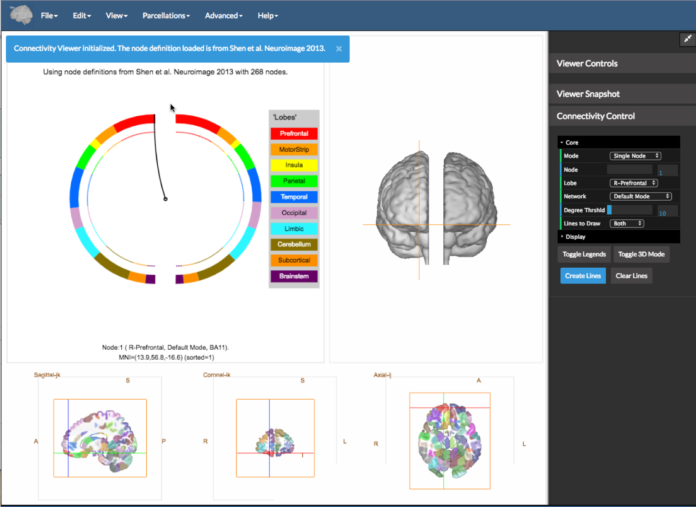
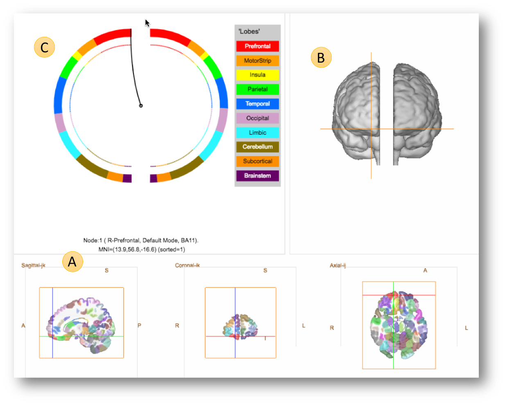
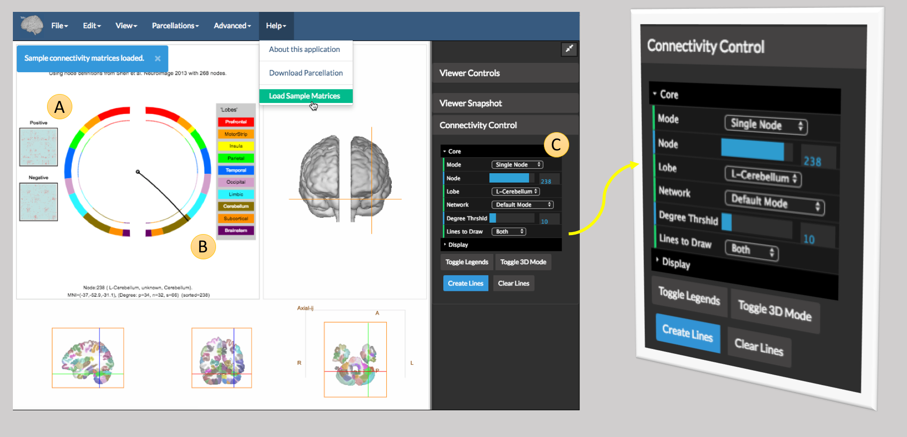
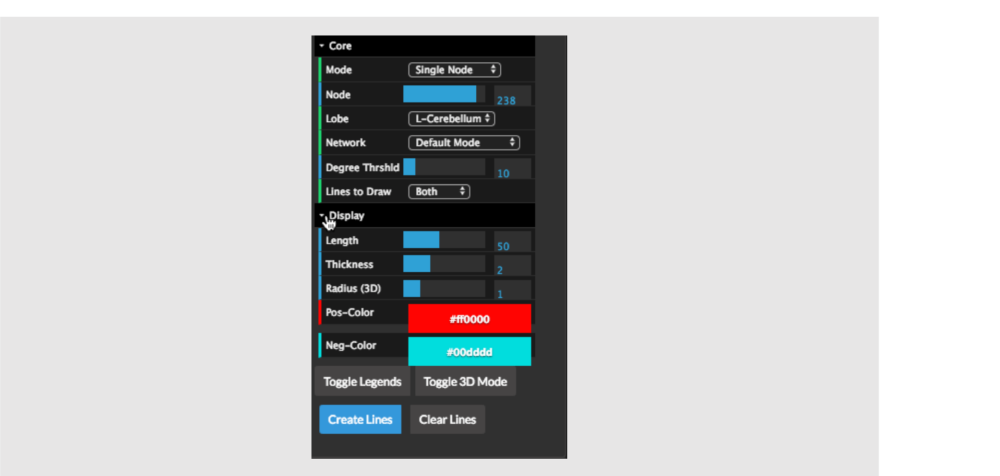
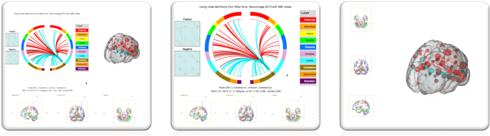
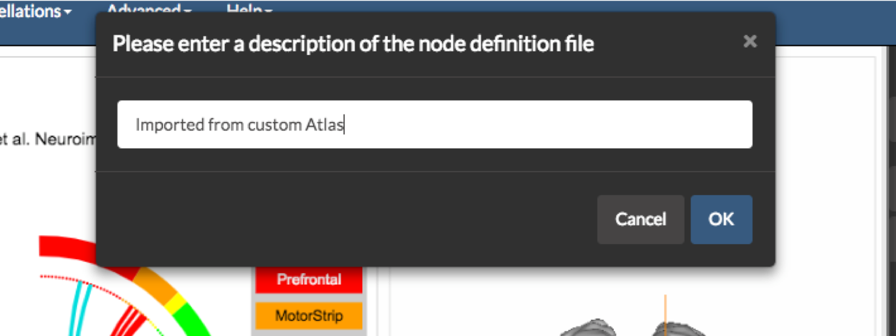
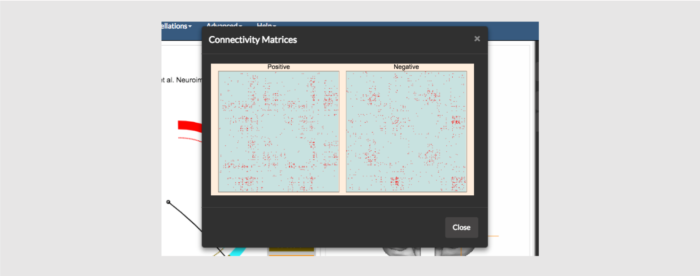
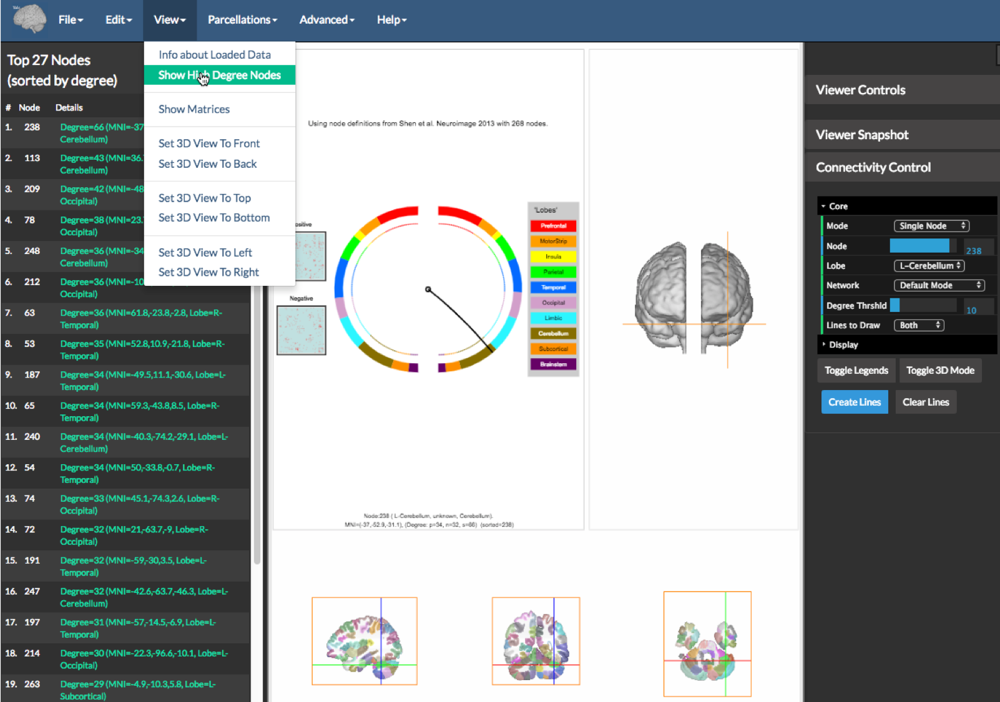

[Back to main page](../index.html)

---

# The Connectivity Visualization Tool

This application is also described in [Shen et al, Nature Protocols 2017](https://www.ncbi.nlm.nih.gov/pmc/articles/PMC5526681/) -- see in particular Figure 6. It was initially created for the needs of work published in [Finn et al, Nature Neuroscience 2015](https://www.ncbi.nlm.nih.gov/pubmed/26457551) and [Rosenberg et al, Nature Neusocience 2016](https://www.ncbi.nlm.nih.gov/pubmed/26595653). The default parcellation used is from [ Shen at al, NeuroImage 2013](https://www.ncbi.nlm.nih.gov/pubmed/23747961) and is available for download from our [NITRC page](https://www.nitrc.org/frs/?group_id=51).

---

## Using the Application

To open the connectivitity visualization tool navigate to [https://bioimagesuiteweb.github.io/webapp/connviewer.html](https://bioimagesuiteweb.github.io/webapp/connviewer.html).

.

Once the application is opened, you will be presented with a view as shown in the figure above. The Shen 268 region parcellation (Shen et al 2013) is loaded and a panel showing a circle plot (top left), a 3D view (top right) and the linked slice viewer bottom is shown. 

This application can visualize two connectome matrices at once. These can be loaded as the `Positive` matrix and the `Negative` Matrix under the file menu. These should be binary files containing 1 or 0 and stored in .csv file (.txt also works but be careful). The program expects that the matrices are square and have the same dimensions as the underlying parcellation (e.g. 268x268 in the case of the Shen parcellation).

You may also select the [AAL atlas](http://neuro.imm.dtu.dk/wiki/Automated_Anatomical_Labeling) instead from the `Parcellations` menu.

## The Three Panels

The default display shows three linked panels as follows.

* Panel A (bottom) -- the slice view. This is straightforward to understand.  Note, that like the rest of BioImage Suite Web, we follow the standard radiological convention, so in the axial and coronal views the left side of the brain is shown on the right of the image (see the annotations L and R in the image).  If you click in the slice views, the cross hairs you can navigate to different parts of the brain. The point 'clicked' is annotated just below the circles (just above and the right of the `A` in the figure) showing the node, the region and the MNI coordinates.

* Panel B -- The 3D `glass brain` view shows two brain surfaces (one for each hemisphere) slightly separated for better visualization. The default/initial view has the subject facing the screen (hence right is on the left) but can be changed using either by using the mouse or by using the options under the `View` menu (e.g. `Set 3D View to Top` will show the brain surfaces from the top). The cross hairs from the slice views are also shown in the 3D view.

* Panel C -- The Circle View. This is a more abstract visualization of the brain as a circle. The two half circles represent the two brain hemispheres (with the left semi-circle showing the right hemisphere, in standard radiological convention). The circles are color-coded in a rainbow-style coloring with each color representing a part of the brain (e.g. the Pre-frontal lobe is shown in red, the Temporal lobe is shown in Blue etc. as shown in the legent to the right of the circles).

Clicking any point on the circle or the slice views will syncronize the 2 views and also place the cross-hairs in the appropriate location the 3D view.

## Exploring the Application using the Sample Data

Under the `Help` menu select `Load Sample Data` as shown in the figure below

The connectome matrices are shown under `A` (these are simply binary matrices with red dots showing the connections). The currently selected node (`B`) is shown by a line from the center of the circles to its location on the circle, and its location is also shown in the 2D slices and 3D view.

To visualize a connectivity pattern, one uses the controls in the `Connectivity Control` which appears on the far right of the viewer and shown magnigied in the figure above. The options here are:

### The Filtering Controls. 

Given the number of edges in a connectome, it is impractal to visualize them all at the same time. The following controls enable the user to filter edges to highlight aspects of their data. An edge connects two nodes. It will be shown if at least one of the nodes satisfies the filtering criteria below.

* Mode -- this selectes the filtering mode which is one of
    * 'All' -- use all nodes
    * 'Single Node' -- only show edges that connect a specific node
    * 'Single Lobe' -- only show edges that have one connection in a single lobe
    * 'Single Network' -- only show edges that have at least one connection in a single network. (The Networks are as defined by Power et al, Neuron 2011)

* Node -- if the mode is `Single Node`, this control is used to specify the node.

* Lobe -- if the mode is `Single Lobe`, this control is used to specify the lobe.

* Network -- if the mode is `Single Network`, this control is used to specify the network.

* Degree Threshold -- If the mode is not `Single Node` this control is used to futher filter connections to have at least one node that has degree at least equal to this value. `Degree` is defined as the number of non-zero connections of the given node. For thresholding purposes, if two connectome matrices are loaded (a `positive` and a `negative` we use the sum of the two degrees)

* Lines to Draw -- this is one of `Both`, `Positive` or `Negative`. If `Positive` we will only show edges from the `Positive` Matrix, `Both` from both and `Negative` from the negtive `Matrix`.

_Note_: The `Node`, `Lobe` and `Network` entries are automatically updated each time the user clicks either in the circle view or the 2D view to select a node. The values of these are set by the properties of the current node.

### The Drawing Options

Once the filters are set, the user may create the lines using the `Create Lines` button. The lines are additive, so if the user changes the filters and clicks `Create Lines`, the new lines will be drawn in addition to the old lines. To clear the lines use the `Clear Lines` button.

### The Display Controls

At the bottom of the connectivity control, there are some extra options under the `Display` tab. These are initially _hidden_ but can be opened by clicking on the `Display` Tab as shown in the figure above.

These controls, control, how the lines are drawn (as opposed to the filtering controls which control _which_ lines are drawn). The options are as follows:

* (2D Circle View) Length -- this is the line of the edge and controls how straight vs how curved the lines will be. One should play with this to understand what it does.

* (2D Circle View) Thickness -- the thickness of the lines -- setting this to a higher value makes the lines thicker.

* (3D View) Radius -- this controls the scaling of the spheres (nodes) as shown in the 3D view. The size of the sphere that represents a given node is a product of the radius and the degree of the node.

* Pos-color -- the color of the lines for positive edges.

* Neg-color - the color of the lines for negative edges.

There are also two buttons below these namely:

* `Toggle Legends` -- this shows or hides the annotation on the figures (e.g. the key describing the mapping between colors and lobes next the circle plot).

* `Toggle 3D Mode` -- this switches the viewer between 3 modes as shown below.

## Using your Own Data

### Parcellation

If your data was computed using the Shen et al parcellation or the AAL atlas, you may simply select this parcellation from the `Parcellations` menu.

__Importing a parcellation as an image:__ You may import a parcellation either as an image or as a text file. In the case of an image, BioImage Suite Web expects an objectmap style image (in MNI space) where the value of each voxel is equal to the region it belongs to. To do this click on the option `Import Parcellation as an Image` under the `Advanced Menu`

__Importing a parcellation as a text file:__ In this scenario, the user simply supplies the MNI coordinates of each node. This may be either a CSV or a text file with each node being specified on each line.

In both cases, once the import is completed, the user will be prompted to enter a description of the atlas and then to save it in a JSON format file with a `.parc` extension. In the future this file may be loaded using the `Load Node Definition File` under the `File Menu`

### Connectome Matrices

This application can visualize two connectome matrices at once. These can be loaded as the `Positive` matrix and the `Negative` Matrix under the file menu. These should be binary files containing 1 or 0 and stored in .csv file (.txt also works but be careful). The program expects that the matrices are square and have the same dimensions as the underlying parcellation (e.g. 268x268 in the case of the Shen parcellation).

To load the first connectome matrix, simply use the `Load Positive Matrix` option under the `File` menu. If you would like to load a second matrix use the `Load Negative Matrix` option under the same menu. To clear the matrices use the option `Clear Matrices` also under the `File Menu`.

You may also visualize the matrices, as matrices, using the option `Show Matrices` under the `View` menu as shown above.

Finally one can get information about the matrices using the option `Show High Degree Nodes` under the `View` menu as shown on the figure above. This will create a table a left sidebar (see figure above) showing the information about the top nodes. Clicking on any of the node entries in `green` will place the cross hairs of the viewer and circle on the particular node's location.

