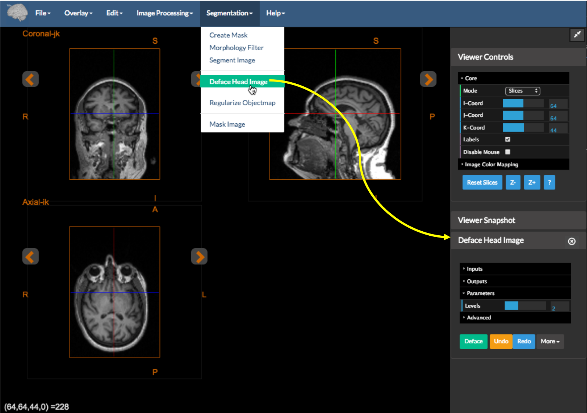
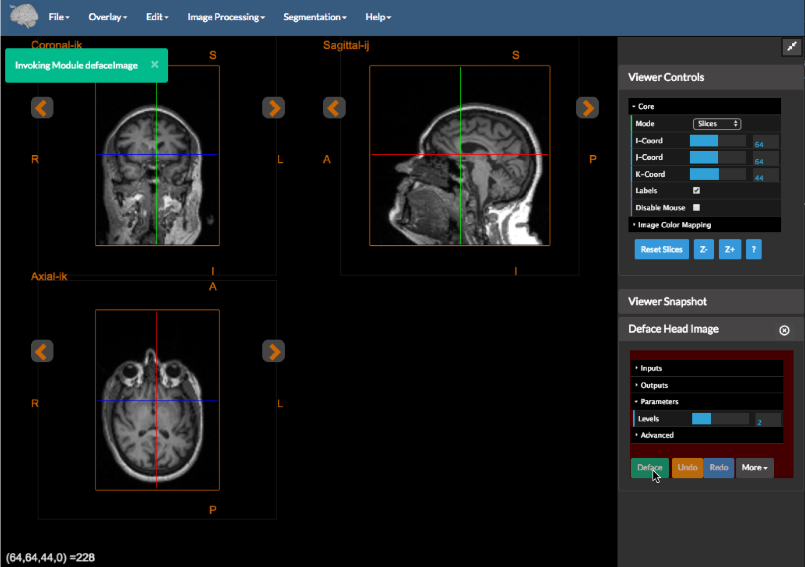
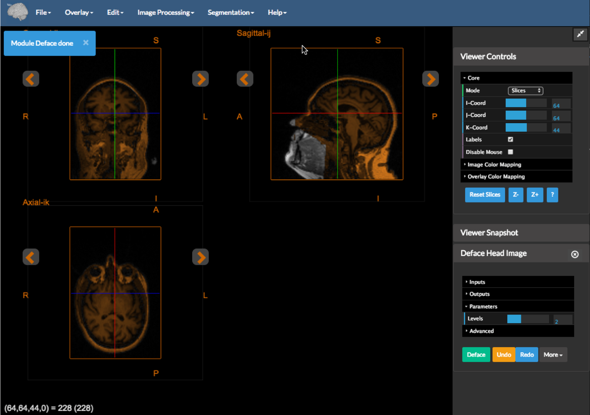
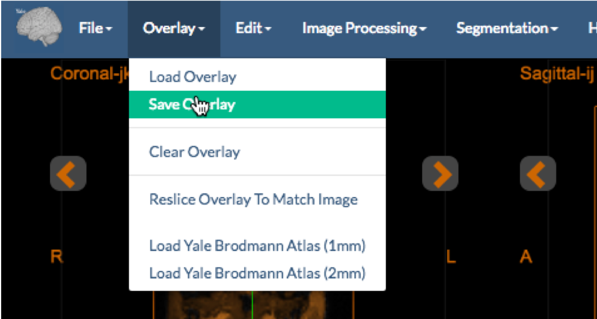
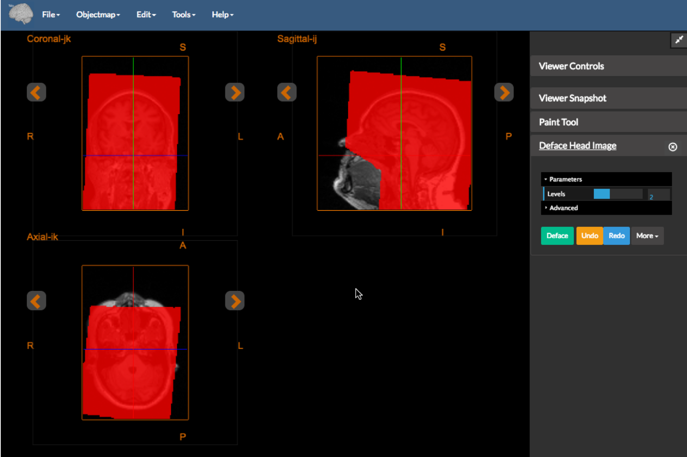
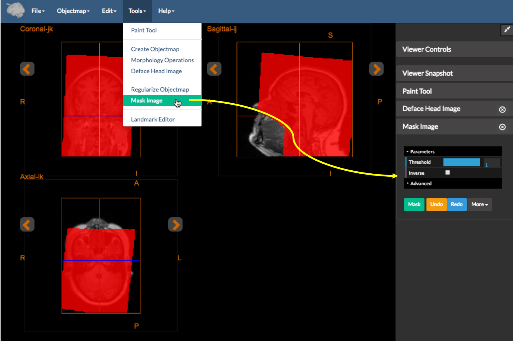
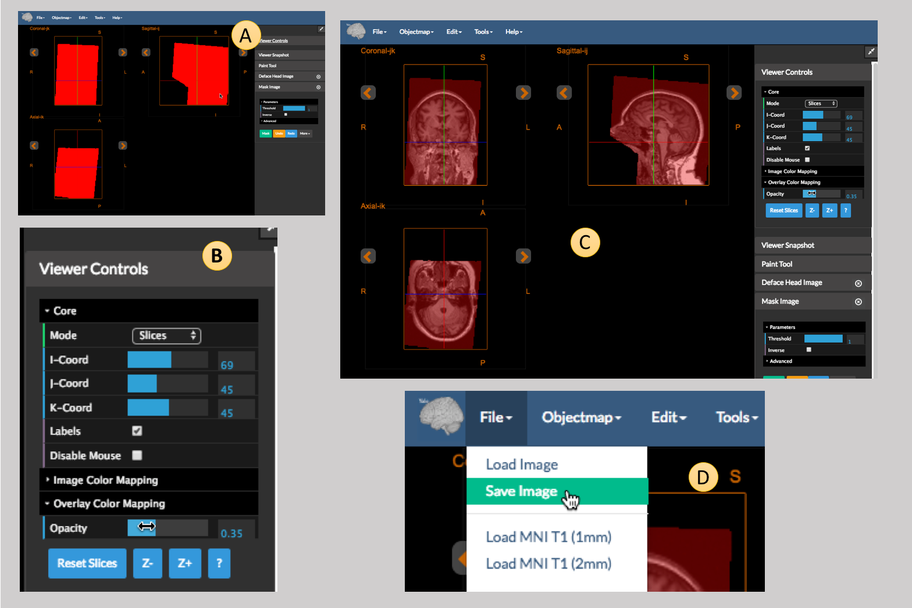

[Back to main page](../index.html)

---

# Image Defacing

This is a common procedure required to fully anonymize an MR brain image. This procedure masks out the face in an MRI making it impossible to "recognize" the subject (if the image is volume rendered or the face surface is extracted). 
Our implementation derives (and uses data from) [the OpenfMRI Project](https://github.com/poldrack/openfmri/tree/master/pipeline/facemask).

---

## Method 1 -- Simple Version

This is a a fully automated process as follows:

1. Open the [orthogonal viewer](https://bioimagesuiteweb.github.io/webapp/viewer.html) tool in BioImage Suite Web.

2. Under `File` menu select the `Load Image` option and then load the image you would like to deface. Alternatively simply drag the file and "drop" it into the viewer

3. Under the `Segmentation` menu, select `Deface Head Image`. This will open the `Deface Head Image` Tool and place it in the sidebar as shown in the figure above.

4. Press the "Deface" button (in Green) -- this is under the mouse cursor in the image above

5. Wait for a little minute -- this might take a minute or so depending on the speed of your computer. __Please realize that all processing is done locally. No data is ever uploaded to any of our servers__.

6. Once the defacing process is completed, the result will be overlaid on the original ,as shown in the figure above, using a brown-ish colormap. You can see that in the sagital view above the overlay is missing the face region (as it should).

7. To save the result, save the overlay image using the `Save Overlay` option under the `Overlay` menu as shown above.

---

## Method 2 -- The more Complicated Version with Editing

This is a version of the method above that allows for manual editing and masking.

Repeat steps 1-5 but using the [Image Editor](https://bioimagesuiteweb.github.io/webapp/editor.html) tool instead. The only difference is that the `Deface Head Image` option is located under the `Tools` menu.

Once the defacing process is completed you will get an editable mask shown in red in the figure above. This can be edited using the `Paint Tool` (see [the intro manual page](../index.html) for more details.)

Once you are happy with the edited mask you may create the defaced image using the `Mask Image` tool as shown in the figure above. Press the green `Mask` button to initiate the process.

When the masking is done you will probably see something like the view shown in panel A of the figure above, which looks confusing. This is because the mask is completely opaque and hides the image. Under Viewer controls (panel B), expand the `Overlay Color Mapping` tab and adjust the `Opacity` to something smaller than 1. This will adjust the view to something like what is shown in panel C. Finally you may save the resulting masked (defaced) image using the `Save Image` option under the `File Menu` (panel D).

