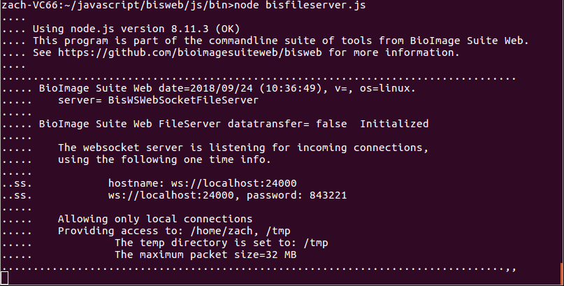
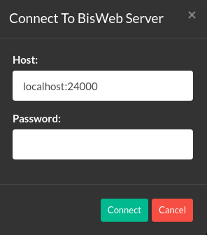

# BioImage Suite's File Server

Applications run from the browser are only able to access a local filesystem at a fairly primitive level — the user must select an item to load manually and confirm that they want the browser to load it. Saving is even more restricted. When saving the application is restricted to creating a "download" object which the user may choose to save or ignore. The application is never told of the outcome. (Aside: a consequence of this is that when you try to save an image in BISWEB, the hard work is done before you select the filename, as the software needs to create the `download`. That is why, when saving large files to disk, it takes a while for the file dialog to appear.)

 The interface is  limited for security reasons, as if the browser could inspect the file system without any check, it would be trivial for a malicious script to download private files and send them to an arbitrary destination. 

This restriction would be particularly onerous when running image processing pipelines that require saving and loading dozens of images at each step: the user would need to accept the request for each file manually and drag it into the application. The BioImage Suite file server is designed to circumvent this limitation by uploading and downloading data from the server through a trusted link. 

The server itself is a [Node.js](https://nodejs.org/en/) process that you must connect and authenticate with before the server will accept data. We will cover how to run the server and configure BioImage Suite to use it as its source in the sections below.

## Getting the File Server

__This section assumes that you have the ability to download and install software and run commands from a command line. On a Mac use the `Terminal` app. On Windows use the `Command Prompt` program.__

You will first need to install `Node.js` vs 8. To do this go to the [Node.js download page](https://nodejs.org/en/download/) and download and install the appropriate version for your operating system. (As of Oct 2018, this is version 8.12). Next you need to download the BioImage Suite Web file server itself. The latest version of this can always be found at [this location](https://bioimagesuiteweb.github.io/webapp/server.zip). Alternatively you can get to it using the BioImage Suite Web graphical interface as shown below:

Open the `Select file source` dialog from any application under the `Help` menu as shown above. Then click on the `from this link` link at the bottom of the selector. This will let you download the latest version of the file server as a zip file.

1. Unzip this zip file somewhere on your computer -- we will call this location `DIRECTORY`. 
2. Open the command line (either `Terminal` on Mac or `Command Prompt` on Windows)
3. Type `node -v` to ensure that you have a working version of node.js. You should get something like `v8.12.0`. If this gives an error __stop__ and make sure node.js is correctly installed.
3. Navigate (`cd`) to the DIRECTORY containing the file `bisfileserver.js`.
4. Next download the dependencies of the server using the `npm` utility (this should have been installed as part of node.js) by typing
    npm update

`npm update` may take a little time as this needs to download some packages. On Windows you will something similar to the figure below.

## Running the File Server

To run the file server, open a command line and navigate to the directory containing the file `bisfileserver.js` (see `Getting the File Server` above). Then you can run this by typing

    node bisfileserver.js <OPTIONS> 

The options (_all are optional!_) for the file server are as follows:

Flag | Description | 
-|-
 -p, --port <port_number> | Which port the server will listen on. This will be the number that follows the colon in the hostname when connecting to the server.
 --readonly | If this flag is specified, the server will not accept requests to write files. 
--insecure | If this flag is set, the server will not ask for a One-Time Password when you connect. As the name suggests, setting this flag may undermine the security of the files on your system, __use with care__.
--verbose | Prints more detailed information from the server while it's running. 
--tmpdir <directory_name> | Which temporary directory to use, i.e. where the server will default to saving. 
--config <file_name> | Whether the script that starts the BioImage Suite file server should read from a config file that may specify many options on the command line. This is helpful if you have a complex ipaddr, tmpdir, etc.
--createconfig | Takes the options currently written on the command line, saves them in a file, then exits. For example, you might create a config file that will run in insecure mode by writing `node bisfileserver.js --insecure --createconfig`.
-h, --help | Prints the help file for the file server.

Once you have started the File Server with a satisfactory configuration, you are ready to connect from the web.

_Figure 1: An example of what the File Server may look like once it's running. Note the displayed hostname, port number, and password._ 

## Connecting to the File Server

[Open BioImage Suite](https://bioimagesuiteweb.github.io/unstableapp/) to the viewer of your choice. 

The first step is to select the File Server from the file source menu. You may change this setting by going to `Help` -> `Set File Source` and selecting BioImage Suite File Server Helper. 

_Figure 2: The file source menu with the File Server item highlighted._ 

Once this is done, open the `File` menu and select any load or save option. You will then be prompted with a connect screen containing a hostname and password field. Enter the hostname and port number (hostname then a colon then the port number) and the password printed to the console to connect. 

_Figure 3: The Bisweb Server connect screen._

Once you've logged in to the server you will be presented with the root directories of your local filesystem. The figure below breaks down all the elements of this complex dialog:

_Figure 4: The dialog that will appear when loading or saving files to the file server._ 

A. The file path. `[Root]` indicates that you are looking at the base     folder of the file system; this path will expand as you continue to navigate in the file browser (see Figure 5).

B. The bookmarks window. Folders that are used for I/O commonly can be saved here and navigated to quickly.

C. The file browser. Click on folders to open them and files to select them. 

D. The current filename. Selected files will have their name displayed in this box. While saving a file, you type your desired file name here. 

E. The file filter selector. Only files of the selected type, i.e. that end in a given file extension, will be displayed. 

F. The close and load buttons. These will close the modal or load the selected image to the viewer. If this was a save and not a load modal, the load button would be replaced by a save button.

_Figure 5: The dialog after clicking a few directories. Note the expanded filepath and bookmarks._ 

After clicking around a little the File Server dialog should look more like this. You can go back to the root directory by clicking `[Root]` on the top-left, or any other directory in the path of your currently expanded directory by clicking its name. 

## Closing the File Server

Once you are done with file operations it's good to terminate the server. Leaving connections open carries [serious security risks](https://superuser.com/questions/82488/why-is-it-bad-to-have-open-ports), and we can't promise that the server is completely secure.

1. Click in the terminal window where yo started the process.
2. Press `Control-C`
