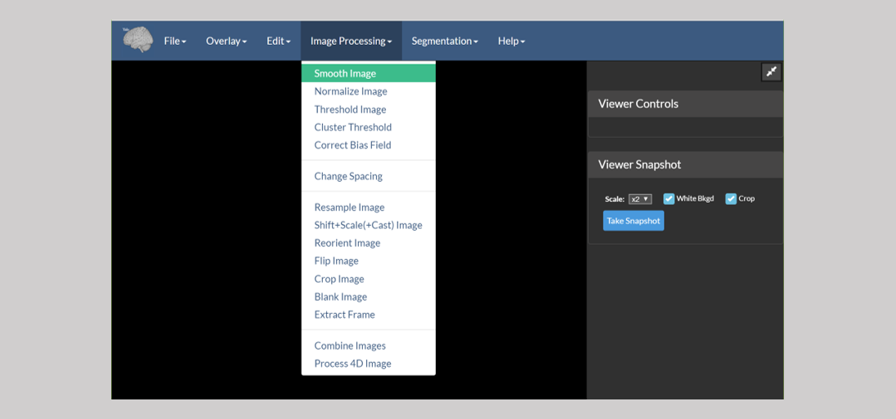
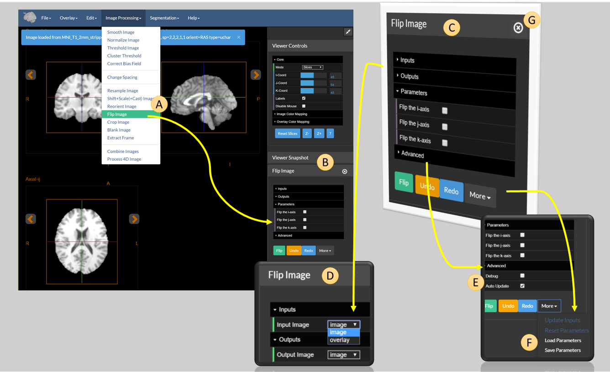
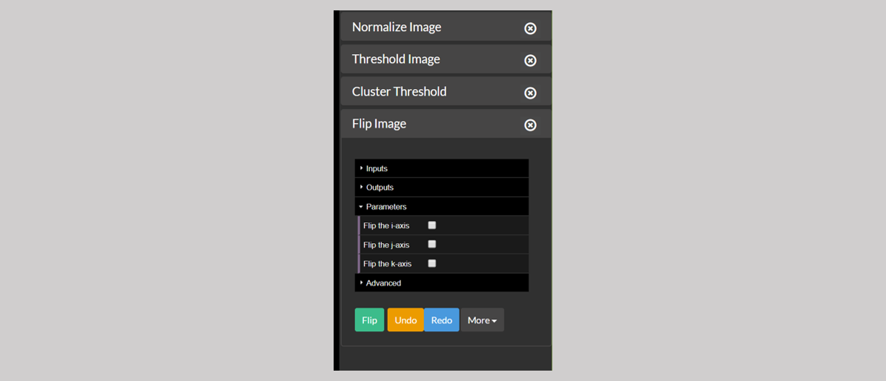
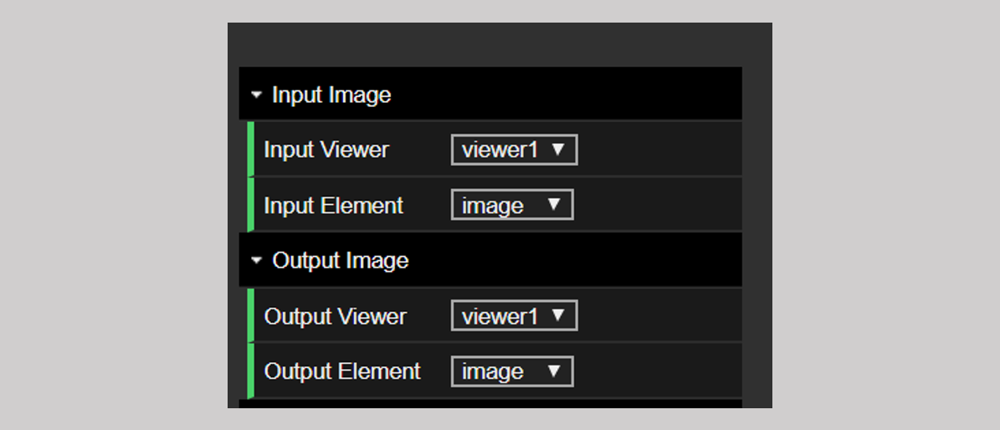

# Image Processing Tasks In BioImage Suite Web

The component applications in BioImage Suite Web provide the ability to perform many `standard` medical image analysis processing tasks. These are available from the `Image Processing` menu of the [main  orthogonal or `single` viewer application](../viewers.md) and the [dual viewer](../dualviewer.md) applications.

## Tools Summary

In the [Orthogonal Viewer Tool](https://bioimagesuiteweb.github.io/webapp/viewer.html) these appear as:

These tools perform the following tasks:

* __Smooth Image__ -- this can be used to perform Gaussian Image Smoothing
* __Normalize Image__ -- this can be used to normalize the intensity range of the image -- we use it to proprocess images for registration (automatically as part of the registration tools)
* __Threshold Image__ -- used to threshold the image
* Cluster Threshold Image -- a variation of the threshold tool, in which we use clustering to elimninate small bright clusters of voxels.
* __Correct Bias Field__ -- this essentially a slice-inhomogenerity correction tool, used to alleviate B1-bias field artifacts in MRI images.
* __Change Spacing__ -- this is used to change the voxel spacing (essentially the resolution) in the header of an image -- _the image is not changed in anyway, only the interpratation of the header_. This is often needed when the image was saved incorrectly from, for example, random matlab scripts.
* __Resample Image__ -- this is used to resample an image to a new resolution.
* __Shift+Scale+(Cast Image)__ -- this used to (i) manipulate the image intensities e.g. Y=scale*(X+shift) and to change the image type (e.g. to short, or to float).
* __Reorient Image__ -- this is used to reorient a medical image to a standard orientation (e.g. RAS or LPS). The reorientation is simply performed by permuting the axes. No interpolation or resampling is done.
* __Flip Image__ -- this is used to flip an image along any combination of the i,j and k-axis.
* __Crop Image__ -- this is used to crop an image to extract a piece out of an image. The cropping can be done in 4D to extract a subset of the frames in a 4D image. This can also be used to pad an image if negative bounds are used.
* __Blank Image__ -- this is similar to crop image but instead of the image being cropped, the `outside` region is simply blanked (or zeroed-out).
* __Extract Frame__ -- this can be used to extract a single frame from a 4D image.
* __Combine Images__ -- this can be used to combine two images (add, substract, multiply, divide, append)
* __Process 4D Image__ -- this is used to process a 4D image along its time axis. Here we can compute, for example, the _mean_ frame and other similar measures.

__Note__: All of these modules can be run on the commandline as well -- see the [Command Line Tools document](../CommandLineTools.md) for more information. The modules can also be regression tested (in your own browser) -- see the [Testing](../biswebtest.md) document for more on this.

## Using a Tool -- Single Viewer Mode

All the tools can be used in the viewer in a very similar manner. They take as their input on of the two images in the viewer (either the `image` or underlay, or the `overlay`) and send their output back to the viewer (again to one of those images). For example consider the case of the `Flip Image` tool, as explained in the figure below.

The tool is accessed using the `Flip Image` option under the `Image Processing Menu` (see `A` in the figure above). This opens the tool and places it in the viewer sidebar (stricly the right sidebar) -- see `B` in the figure.

An expanded version of `B` is shown in `C`. The tool control consists of the following options:

* The `Inputs` tab (expanded in `D`) which allows the user to select the input image.
* The `Outputs` tab which is similar to the `Inputs` tab and allows the user to select the destination or output image (i.e. the result of this operation).
* The `Parameters` tab -- which allows the user to set the parameters of the operation. In this case, the parameters allow the user to select which combination of the three axis (i,j, or k) to flip.
* The `Advanced` tab (expanded in `E`) which allows the user to set advanced parameters. Generally one should not need to touch these, unless they really know what they are doing.
* The button bar at the bottom with three buttons:
    * Flip -- this executes the tool
    * Undo and Redo -- these (at least try) to undo or redo the last operation
    * The dropdown menu `More` which provides some more advanced operations (expanded in `F`).

The Inputs tab (`D`) (and similarly the Outputs tab) allow the user to select which image to process. Each viewer can have two images, the `image` and the `overlay`. By default all image processing tools take as their input the current `image` in the viewer and __overwrite__ this with their output. One can easily select to have the output go to the overlay (perhaps to compare the images) or any other combination. [ Images can be moved from `image` to `overlay` and back, using the `Advanced Transfer Tool`, accessible under the `Edit` menu.]

The extra options `F` deserve a little more explanation. These are:

* Update Inputs -- this is used in certain advanced scenaria to force the tool to reread its input from the viewer.
* Reset parameters -- this is used to reset the tool to its default parameters
* Save Parameters -- this is used to save the current parameters in the tool to a json (.param) file, that takes the form:

        {
            "module": "flipImage",
            "params": {
                "flipi": false,
                "flipj": true,
                "flipk": false,
                "debug": false
            }
        }

* Load Parameters -- this is used to load back an existing parameter set and to set the values in the tool.

An advanced usage scenario is to configure parameter sets in the GUI (web-applications), especially for complex tasks, and to reuse these on the commandline. The commandline tools have a flag (`--paramfile`) that can be used to load all parameters from a such a parameter file and use them.

Finally in `G` we highlight the `close` button. The sidebar can show only up to four tools (see the figure below). If an additional tool is opened, at this point, then the `Normalize Image` control will be removed from the sidebar (it can be reopened from the `Image Processing` menu). The user may manually remove a control from the sidebar using the `x` button in its title bar.

## Using a Tool -- Dual Viewer Mode

In the Dual Viewer application, there is an additional set of options for setting the `input` and the `output` image. As shown in the figure below, both the input and the output have an additional "Viewer" tab. In this way, one can choose to `flip` the image in viewer 1 and send the output to `viewer 2` or any one of many other possible combinations. The rest of the functionality is identical.

