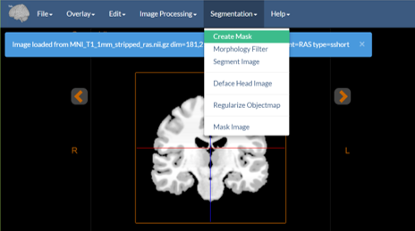

# Image Segmentation Tools In BioImage Suite Web

The component applications in BioImage Suite Web provide the ability to perform simple image segmentation tasks. We define segmentation here as the creation of a new image whose values (e.g. 0,1,2,3) are labels for specific regions. The output of a segmentation task is used to create an objectmap image as described in more detail in the [Editor](../imageeditor.md) tool.

These tools are available both within the standard [Orthogonal Viewer](../viewers.md) and [Dual Viewer](../dualviewer.md) applications and also in the [Editor](../imageeditor.md) tool. In the case of the first two applications, the segmentation tools can be accessed from the `Segmentation` menu. In the case of the `Editor` these can be accessed under the tools menu.

We recommend that for most applications, one should use these tools within the `Editor` application unless there is good reason to do otherwise (some advanced scenaria benefit from the `Dual Viewer` -- especially if no painting/interactive editing needs to be performed).

In addition, given the similarity in workflow between these tools and the image processing tools, we recommend that one reads the document [describing the image processing tools](./imageprocessing.md) prior to continuing with this document.

## Tools Summary

In the [Orthogonal Viewer Tool](https://bioimagesuiteweb.github.io/webapp/viewer.html) these appear as:

These tools perform the following tasks:

* __Create Mask__ -- this is a binary thresholding tool that creates a binary image mask from the input image, using user-specified thresholds.
* __Morphology Filter__ -- this allows the user to perform mathematical morphology operations (median filter, dilate, erode, seed-based connectivity) on a binary image and output a modified binary image. Many simple segmentation strategies consist of a thresholding operation (`Create Mask` in our case) followed by morphology operations to clean up the result.
* __Segment Image__ -- this performs either k-means clustering or k-means clustering with Markov Random Field smoothing to segment an image into classes (depending on the smoothness parameter is set to a value greater than zero). This can be used to, for example, segment a CT image into bone, tissue, air, or a stripped MRI brain image, into gray, white and CSF.
* __Deface Head Image__ -- this runs the Deface Image Tool to remove the face from a brain MRI image. See the description of this in [separate document]](./defacing.md).
* __Regularize Objectmap__ -- this is a more advanced smoothing technique for objectmaps to smooth ragged edges etc. It uses a markov random field prior to create a smoothed version of the existing objectmap.
* __Mask Image__ -- this uses an objectmap to mask parts of an underlying image.

__Note__: All of these modules can be run on the commandline as well -- see the [Command Line Tools document](../CommandLineTools.md) for more information. The modules can also be regression tested (in your own browser) -- see the [Testing](../biswebtest.md) document for more on this.

## Using the Tools -- Single Viewer Mode

_We describe here the usage of these tools within the Orthogonal Viewer_ application, though this is very similar in the other two contexts (dual viewer or editor).

All the tools can be used in the viewer in a very similar manner. They take as their input on of the two images in the viewer (either the `image` or underlay, or the `overlay`) and send their output back to the viewer (again to one of those images). In particular, the `Create Mask`, `Segment Image` and `Deface Head Image` tools take as input (by default) the image and stores the result in the overlay. The `Morphology` and `Regularize Objectmap` tools take as input the `overlay` image and store their result in this as well. Finally the `Mask Image` tools takes two inputs (the image to be masked from the `image` and the `mask` from the overlay) and creates an output that is stored in the viewer image.

Just like the `Image Processing` Tools once selected from the menu, these tools appear in the right sidebar of the application.
