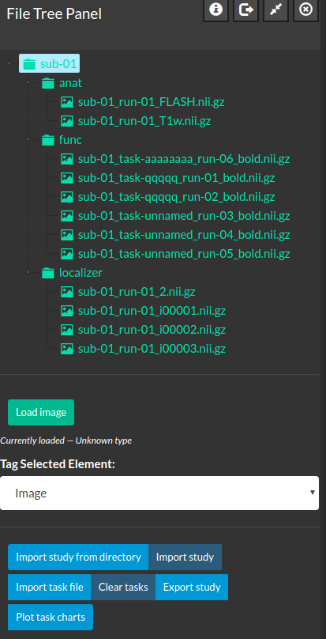

# File Tree Panel 

This document will describe the features of the file tree panel, how it is opened, and how it can change the files on disk. 

## Opening the File Tree Panel

The file tree panel is meant to display study files that are stored on disk and to display files that are converted from a raw file format, e.g. DICOM or Bruker. Often operations performed on files displayed in the file tree panel will modify the files on disk to ensure internal consistency (consider for example if you change the name of an image file but not its supporting files). 

  

<i>Figure 1: The file tree panel with a study loaded.</i>

