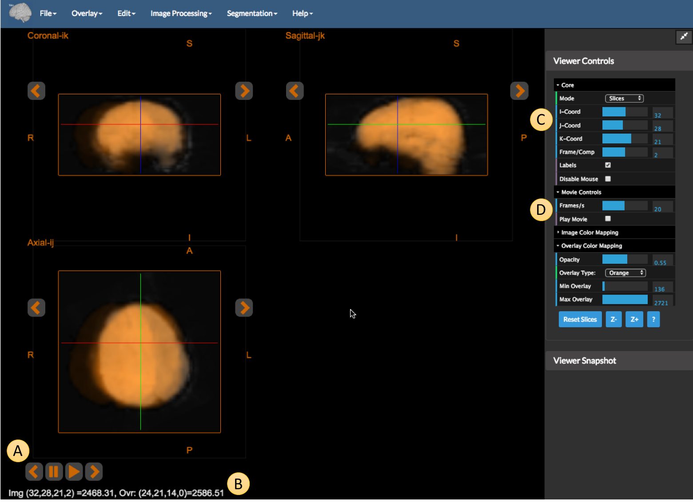
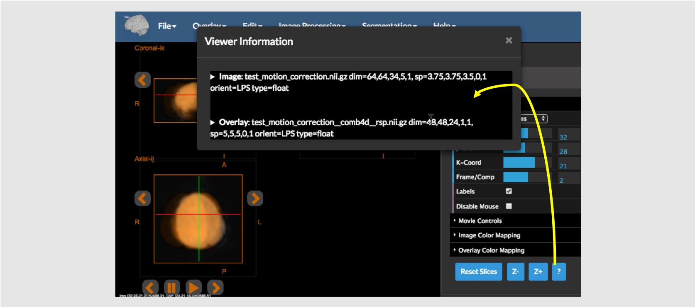

## Displaying Images

All BioImage Suite web applications share components and have a similar user interface. The picture below shows the [Orthogonal Viewer Tool](https://bioimagesuiteweb.github.io/webapp/viewer.html). This viewer consists of a single viewer plus some controls. All viewers in BioImage Suite Web can display two images:

1. The "underlay" or "background" image -- this is often the anatomical image and be loaded and saved from the `File` Menu.
2. The "overlay" or "objectmap" image -- this is often a functional image or a segmentation image. This can be loaded and saved from the `Overlay` menu.

The application consists of the following parts:

* A. The Menu Bar -- this provides access to all data IO and algorithmic functionality in the application. 
    * `File` -- functionality for loading and saving the underlay anatomical image
    * `Overlay` -- functionality for loading and saving (and clearing) the overlay functional image. 
    * `Edit` -- typically contains Undo and Redo functionality for image manipulation operations and tools to move images from overlay to image etc.
    * `Image Processing` -- standard image processing and maniuplations tools. Details can be found [here]().
    * `Segmentation` -- modules to perform image segmentation. Details can be found [here]().
    * `Registration` -- (availble in `Dual Viewer` application) image registration modules. Details can be found [here]().
    * `Help` -- this contains the usual `About this Application` option plus options for setting user preferences.

* B. The Viewer (the `Dual Viewer` application has two viewers) can display the underlay and the overlay images in either single slice or three-linked slice views. There is also a viewer component (see `Overlay Tool`) which displays multiple parallel sections of the same image. Orange arrows, next to each slice view, allow you to increment or decrement that slice as desired. If the image is '4D' then movie controls will appear at the bottom of the screen.

* C. The image information under the cursor. As you click in the image, the current coordinates (i,j,k) of the image and the current intensity of the image (and the overlay if present) are shown here in the format: `(i,j,k) = itensity (overlay intensity)`

* D. The side panel containing viewer and algorithm functionality controls. 

* E & F. The `Viewer Controls` allow the user to control how the underlay image and the overlay image, if available, is displayed. Arrows on the left can be used to collapse or expand these controls as desired.
  * `Core` viewer controls: 
    * `Mode` -- this selects single slice or three orthogonal slice view.
    * `I-Coord`, `J-Coord`, `K-Coord` -- sliders to select the `i,j,k` coordinates of the viewer crosshairs.
    * `Frame` -- (appears if 4D data is loaded) selects the currently displayed image frame in the viewer.
    * `Labels` -- toggle shows and hides labels in the viewer (all text and lines.)
    * `Disable Mouse` -- toggle locks the viewer from user mouse input. The cross-hairs may only be changed using the `I,J,K-coord` sliders.
    * `Reset Slices` -- resets the viewer to default 'zooms'.
    * `Z-` and `Z+` -- buttons perform zoom in and out operations. You may also zoom using the mouse wheel in the usual way.
    * `?` -- shows the current image information ('See H'). 
  * `Image Color Mapping` controls set the windowing for the anatomical/background image: 
    * `Min Int` -- intensity values below this value are set to black (and also fully transparent).
    * `Max Int` -- intensiry values above this value are saturated to white.
    * `Interpolate` -- flag can be used to allow WebGL interpolation or not (smoother images vs being able to see the actual voxels).
    * `Auto-Contrast` -- toggle enables automatic windowing, if desired.
  * `Overlay Color Mapping` ('See G') (appears if an overlay image is loaded) controls to adjust the overlay/functional image display properties:
    * `Opacity` -- adjusts the translucency of the overlay image.
    * `Overlay Type` -- selects the coloring scheme for the overlay. Depending upon the type selected, the following options will be displayed:
      * `Min Overlay` -- overlay intensity values below this value are set to black (and also fully transparent).
      * `Max Overlay` -- overlay intensity values above this value are saturated to the full color selected.

  * `Movie` (appears in the case of 4D data) controls for playing a movie:
    * `Frames/s` -- set the movie frame rate in frames/second.

* I. `Viewer Snapshot` tool. It can be used to save a snapshot of the current viewer in a png file. The three sub controls are:
  *  `Scale` -- sets the size of the image in voxels relative to the size of the viewer. For publication quality set this to 'x5' (five times) or higher.
  *  `White Bkgd` -- sets the viewer background to white instead of black.
  * `Crop` -- if turned on automatically crops empty space in the viewer to give a more pleasing snapshot.
  * `Take Snapshot` -- this actually invokes the code to acquire a snapshot.

* J. The "double arrow" icon at the top right of the sidebar can be used to minimize and restore the sidebar.

---

### 4D Images and Movie Display

The figure above shows the viewer displaying two images. The underlay image is a 4D image (once of our synthetic test motion images with exaggerated motion) and the overlay is the average frame of the 4D image resampled to a lower resolution (for illustration). Four things in particular from this figure are worth pointing out:

* A -- the movie controls. When either image (underlay or overlay) is a 4D image, the movie controls automatically appear. You can use these to either manually advance the frame, play a movie step by step.

* B -- the image information in the viewer. This shows the intensity of both the image and the intensity under the cross-hairs. Since the images have different resolution, the coordinates are different, i.e. for the Image (`Img`) we get the value at (32,28,21,2) (frame =2, all coordinates _including_ frame begin at zero), whereas for the lower resolution overlay (`Ovr`) we get the value at (24,21,14,0)  (the last number is capped to the number of frames in the overlay). (Compare this to item `C` of the previous figure.)

* C -- the `Core` viewer controls we now have a `Frame` control. This allows us to set the 4th dimension of the cross hairs. While the range of the I,J and K-coord sliders correspond to the dimensions of the underlay image, the Frame slider, has range equal to the maximum of the the number of frames in the two images.

* D -- the `Movie` controls. This last set of controls allows us to set the frame rate at which a movie will play and provides a secondary means to start/stop a movie in addition to the controls in A.

If at any point, you are curious (or have forgotten) what images are being displayed and their characteristics, simply click on the `?` button under Viewer Controls as shown in the figure above. This will provide information about both images (names, dimensions, voxel size, orientation etc.) For example, it is easy to notice that the two images in the previous two figures have different resolution.

