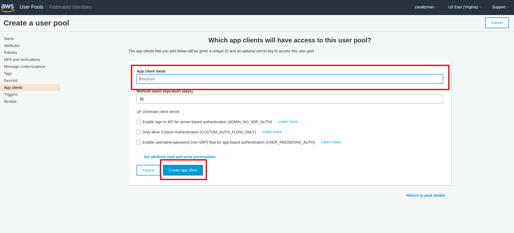
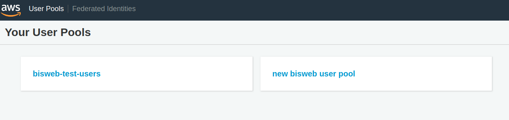
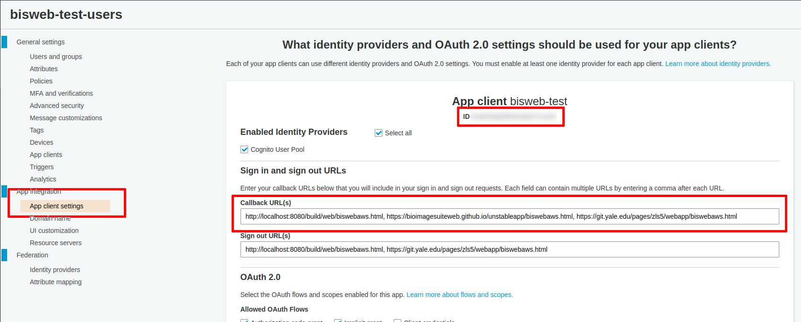
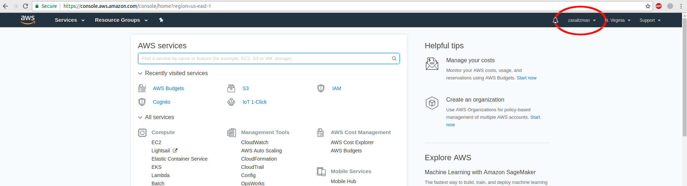
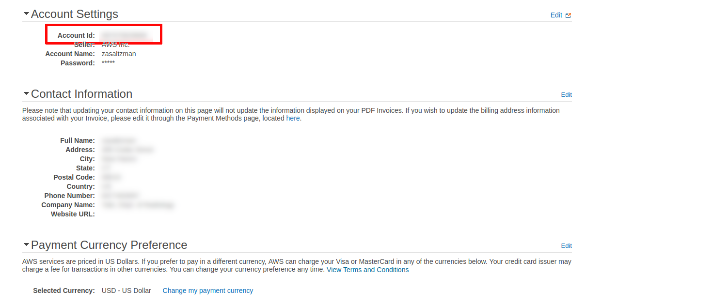

# Creating a New AWS Bucket

BioImageSuite Web is capable of reading files from a user's AWS Buckets, but configuring this properly requires a bit of setup. This document will explain the most efficient way to create an Amazon AWS account, set up your bucket, and configure it to work with BioImage Suite Web.

## Creating an AWS Account 

The first step to creating a bucket is to create an Amazon AWS account at [the following link](https://portal.aws.amazon.com/billing/signup#/start) (more information about AWS account may be found [here](https://aws.amazon.com/account/)). After entering your account information in the signup screen, follow the tutorial to finish creating your account. Bear in mind that this may require linking a credit card, though what BioImageSuite requires shouldn't exceed the free usage limits.

For BioImageSuite to use your AWS account you will need to do the following:

* Create a User Pool:
    * Create and configure the pool itself
    * Create an App Web Domain within the pool
* Create an Identity Pool
* Create an S3 Bucket
    * Create ad configure the bucket itself
    * Configure your S3 Bucket's Bucket Policy
    * Configure your S3 Bucket's Cross Origin Request Sharing (CORS) Policy

This is quite a few steps, but once configured, you should not need to change any of these settings. We break each step down in detail in the following sections. 

## Creating a User Pool

A User Pool associates your bucket with a particular group of users. Additionally, it can provide an App Client that will handle registration, sign-in, and forgotten passwords. We will need both of these features to use AWS features in BioImage Suite.

Start by finding the Cognito item in the Amazon AWS dashboard (the screen that displays when you log into the Amazon AWS console), then select 'Manage User Pools' once inside.

_Figure 1: The Amazon Cognito menu item on the dashboard (located all the way down the page)._

_Figure 2: The Amazon Cognito main menu._

Step through the options of creating your User Pool. These are fairly self-explanatory and most don't matter for the purposes of BioImage Suite; however, one option must be configured — the App clients.

### The App Client 
Once you are at the App client screen, click 'Add an app client' and fill out a name for your App client. You may change the other options for your app client if you would like, but BioImage Suite is designed to run with the defaults — be careful not to check 'Only allow Custom Authentication' in particular! Once you are finished, select 'Create app client'.

_Figure 3: The app client input screen that will appear once you click 'Add an app client'._

Once you are finished configuring your User Pool's settings, you will be shown a screen that will let you review your choices. If you are satisfied, click 'Create pool'. This will return you to the main User Pool screen. 

There is one more step required to configure the App client. Find the pool you just created in the main User Pool screen and select its tile. Find 'App client settings' in the sidebar and fill out the 'Callback URL(s)' field under 'Sign in and sign out URLs' with the following line: 

    http://localhost:8080/build/web/biswebaws.html,
    https://bioimagesuiteweb.github.io/unstableapp/biswebaws.html, https://git.yale.edu/pages/zls5/webapp/biswebaws.html

For more information on the App client, you may consult the [following page from the AWS documentation](https://docs.aws.amazon.com/cognito/latest/developerguide/user-pool-settings-client-apps.html). 'Sign out URL(s)' are currently not used by BioImage Suite so you may leave this blank.  

While on this screen, also note the App client ID listed near the top of the page. You will need it to create your Identity Pool.

_Figure 4: The main User Pool screen. Note that the tiles on this screen will have different names depending on what you named your User Pools, so you should select the tile with the name that you assigned to your User Pool._

_Figure 5: The app client settings screen. Select the option highlighted in the sidebar on the left and then enter the Callback URLs listed above into the highlighted field. The App client ID is also highlighted here, but the ID itself is blurred out._ 

## Creating an Identity Pool

An Identity Pool associates a particular account with a particular application and provides credentials to allow its users authenticated access to its resources. In this case, your Identity Pool will allow BioImageSuite to know that it's you or another authenticated person attempting to access resources in your bucket. 

Start by finding the Cognito item in the Amazon AWS dashboard (the screen that displays when you log into the Amazon AWS console), then select 'Manage Identity Pools' once inside. 

Create your Identity Pool selecting Cognito as the identity provider. Enter the following:

* Your User Pool ID — This should be the ID of the User Pool you just created. This is found on the General settings page of your User Pool, which you may go to by selecting the 'General Settings' item in the side bar. 
* Your App Client ID — The ID of the App client you created alongside the User Pool. You may find more information on how to find this in the section above. 

This will associate your identity pool with BioImageSuite.

_Figure 6: The General Settings screen for your User Pool, with the menu item and ID field highlighted._

The last step is to create your authentication roles, [which are referenced in the Bucket Policy](#bucket-policy). These names can be anything you'd like but it's recommended to leave the defaults. Note that BioImageSuite uses only the authenticated role, not the unauthenticated role.

_Figure 7: The identity pool creation page with the relevant authentication provider sections highlighted._

_Figure 8: The Identity Pool role page, with the relevant role highlighted in red._

## Creating an S3 Bucket

Find S3 on the console's dashboard and click the link. 

_Figure 9: The AWS Console with the S3 button highlighted._

Once in the main S3 menu, click the 'Create bucket' button and follow the prompts to configure your bucket. Note that BioImageSuite does not currently support encrypted buckets, but this may change in a future release. 

_Figure 10: The 'Create Bucket' button and the prompt it will open._

Once the bucket is created you will need to set two properties to allow it to work BioImageSuite: the Bucket Policy and the CORS configuration.

#### Bucket Policy

The bucket needs to be associated with the BioImageSuite application in order to be accessible from the web browser. This is done using [Amazon Cognito Identity Pools](https://docs.aws.amazon.com/cognito/latest/developerguide/cognito-user-identity-pools.html) to provide security and a unified authentication framework. 

We will have to create an Identity Pool associated with BioImageSuite for you. Once this is done, add the following lines to your bucket's Bucket Policy: 

    {
        "Version": "2012-10-17",
        "Statement": [
            {
                "Effect": "Allow",
                "Principal": {
                    "AWS": "arn:aws:iam::<ACCOUNT_ID>:role/<COGNITO_IDENTITY_POOL_AUTH_ROLE>"
                },
                "Action": "s3:ListBucket",
                "Resource": "arn:aws:s3:::<S3_BUCKET_NAME>"
            },
            {
                "Effect": "Allow",
                "Principal": {
                    "AWS": "arn:aws:iam::<ACCOUNT_ID>:role/<COGNITO_IDENTITY_POOL_AUTH_ROLE>"
                },
                "Action": [
                    "s3:GetObject",
                    "s3:PutObject",
                    "s3:DeleteObject"
                ],
                "Resource": "arn:aws:s3:::<S3_BUCKET_NAME>/*"
            }
        ]
    }

The parts of the policy surrounded by carats will need to be replaced by values relevant to your bucket and values specific to the BioImageSuite User Pools that cannot be published here. 

* <ACCOUNT_ID> designates your Account Id. See [Appendix B](#appendix_b) for more information.

* <COGNITO_IDENTITY_POOL_AUTH_ROLE> designates the name of the authentication role that will be created along with your identity pool. See [the section about identity pools](#identity-pool) for more information.

* <S3_BUCKET_NAME> designates the name of your S3 bucket.

More information about what setting a Bucket Policy can do can be found in the [official S3 documentation](https://docs.aws.amazon.com/AmazonS3/latest/dev/using-iam-policies.html).

_Figure 11: The bucket policy screen found under Permissions->Bucket Policy, with the Bucket Policy button and policy editor screen outlined in red. Note that the editor itself is blurred to hide certain information_

### CORS Configuration

_Figure 12: The CORS Editor screen, accessible through Preferences->CORS Configuration from the S3 dashboard._

The Bucket Policy controls what resources external to S3 can access the bucket by authenticating users and specifying which users can do what. The CORS (Cross-Origin Resource Sharing) Configuration defines exceptions to a security policy known as the [Same Origin Policy](https://en.wikipedia.org/wiki/Same-origin_policy) that is common to all applications that live on the web.

 In essence, the Same Origin Policy dictates that applications from one webpage may not access data from applications in another webpage unless they originate from the same source. This would prevent BioImageSuite, which currently lives on a [Git Pages](https://pages.github.com/) server, from accessing data that lives in your S3 bucket — thus you must add BioImage Suite's URL as a trusted domain in your CORS configuration. You may read about [this topic in detail](https://docs.aws.amazon.com/AmazonS3/latest/dev/cors.html) should you wish, but adding the following lines is sufficient to allow BioImage Suite to access your bucket.:

    <?xml version="1.0" encoding="UTF-8"?>
    <CORSConfiguration xmlns="http://s3.amazonaws.com/doc/2006-03-01/">
    <CORSRule>
        <AllowedOrigin>https://bioimagesuiteweb.github.io</AllowedOrigin>
        <AllowedMethod>POST</AllowedMethod>
        <AllowedMethod>GET</AllowedMethod>
        <AllowedMethod>PUT</AllowedMethod>
        <AllowedMethod>DELETE</AllowedMethod>
        <AllowedMethod>HEAD</AllowedMethod>
        <AllowedHeader>*</AllowedHeader>
    </CORSRule>
    </CORSConfiguration>

## Conclusion

Once these steps are complete your bucket may be accessed through the AWS Bucket Selector within BioImageSuite. This will require you to enter your Identity Pool ID and Bucket Name the first time you add the bucket, but these settings will be retained in the browser cache afterwards. Happy processing!

_Figure 13: The BioImageSuite AWS Bucket selector, accessible through Help->AWS Selector_

## Appendices

### Appendix A: Finding your Identity Pool ID

All AWS resources have a unique identifier associated with them. You will need the ID of your identity pool in order for BioImageSuite to be able to access resources associated with your account. 

The first step is to go to the AWS dashboard find your list of Identity Pools (see [the section on Identity Pools](#identity-pool) for more details). Once inside the dashboard, find your Identity Pool that corresponds to BioImageSuite and go to its settings. The Identity Pool ID should be listed there.

_Figure 14: The Identity Pool Selection Screen. If, for example, "bisweb test identity pool 2" was the Identity Pool associated with your S3 Bucket, this would be where you click._

_Figure 15: The dashboard for an Identity Pool and where to click to display its settings._

_Figure 16: Where to find the ID associated with the Identity Pool. Note that this one has been blurred out, but yours will be here._

### Appendix B: Finding your Account ID

Click the tab labeled with your username in the top right of the Amazon S3 console and select 'My Account'. Your Account ID will be displayed at the top, under the Account Settings tab.

_Figure 17: The tab that contains the 'My Account' item. Note that in your AWS console, this will be your name._

_Figure 18: Your Account ID on the 'My Account' page. Your other details will appear here, but have been blurred out here for privacy reasons._